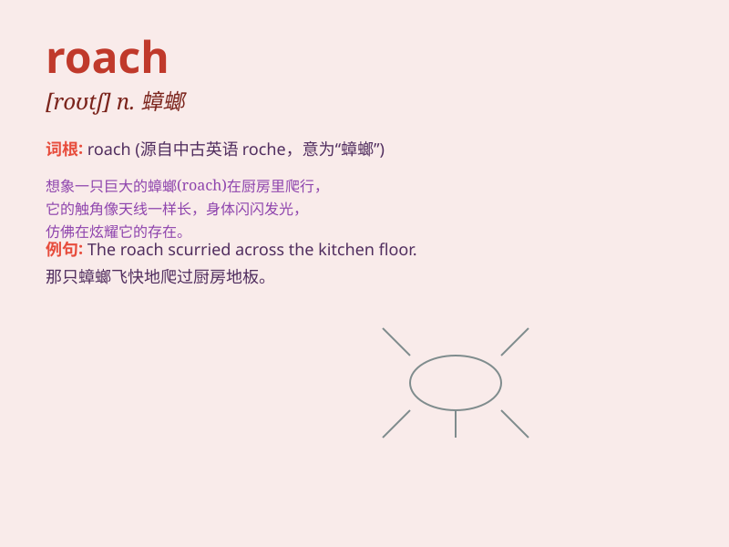

## roach

**英音:** _[rəʊtʃ]_ **美音:** _[rotʃ]_

**译义:** *n.蟑螂vt.使成拱状*

### 短语

+ **roach motel:** _蟑螂旅馆（指只能进不能出的地方）_

+ **smoked roach:** _熏蟑螂_

+ **roach bait:** _蟑螂诱饵_

+ **roach infestation:** _蟑螂侵扰_

+ **giant roach:** _巨大的蟑螂_

### 例句

#### 例句1

> **The roach scurried across the kitchen floor.**

**中文翻译:** 蟑螂急匆匆地穿过厨房地板。

**单词释义:** 蟑螂

#### 例句2

> **He caught a roach while fishing in the river.**

**中文翻译:** 他在河里钓鱼时抓到了一只蟑螂。

**单词释义:** 斜齿鳊

#### 例句3

> **The joint had a roach in it.**

**中文翻译:** 关节里有一只蟑螂。

**单词释义:** 烟头

### 背诵小故事

> A man was fishing by the river. Suddenly, he saw a roach jumping out
of the water. He was so excited because it was a big and shiny roach. He
caught it and took it home for dinner.

**一个男人在河边钓鱼。突然，他看到一只蟑螂从水里跳出来。他非常兴奋，因为这是一只又大又亮的蟑螂。他抓住它并把它带回家当晚餐。**

### 图义

