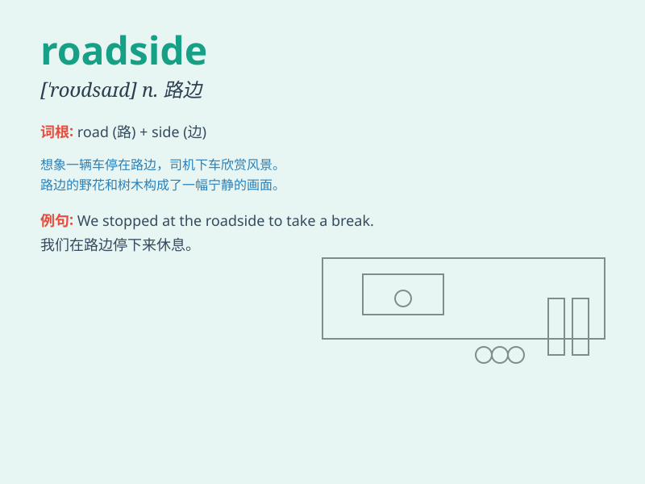

## roadside

**英音:** _[\'rəʊdsaɪd]_ **美音:** _[\'rodsaɪd]_

**译义:** *n.路旁adj.路旁的*

### 短语

+ **roadside assistance:** _路边援助；道路救援服务_

+ **roadside stand:** _路边摊_

+ **roadside picnic:** _路边野餐_

+ **roadside verge:** _路边草地；路旁边缘_

+ **roadside café:** _路边咖啡馆_

### 例句

#### 例句1

> **We stopped at a roadside café for a cup of coffee.**

**中文翻译:** 我们在路边的一家咖啡馆停下来喝了杯咖啡。

**单词释义:** 路边

#### 例句2

> **The car broke down by the roadside.**

**中文翻译:** 汽车在路边抛锚了。

**单词释义:** 路边

#### 例句3

> **There were wildflowers growing along the roadside.**

**中文翻译:** 路边长满了野花。

**单词释义:** 路边

### 背诵小故事

> One day, while walking along the road, Tom saw a beautiful flower by
the roadside. He stopped to smell it and felt very happy. The roadside
was full of surprises.

**有一天，汤姆沿着路走，在路边看到一朵漂亮的花。他停下来闻了闻，感到非常开心。路边充满了惊喜。**

### 图义

