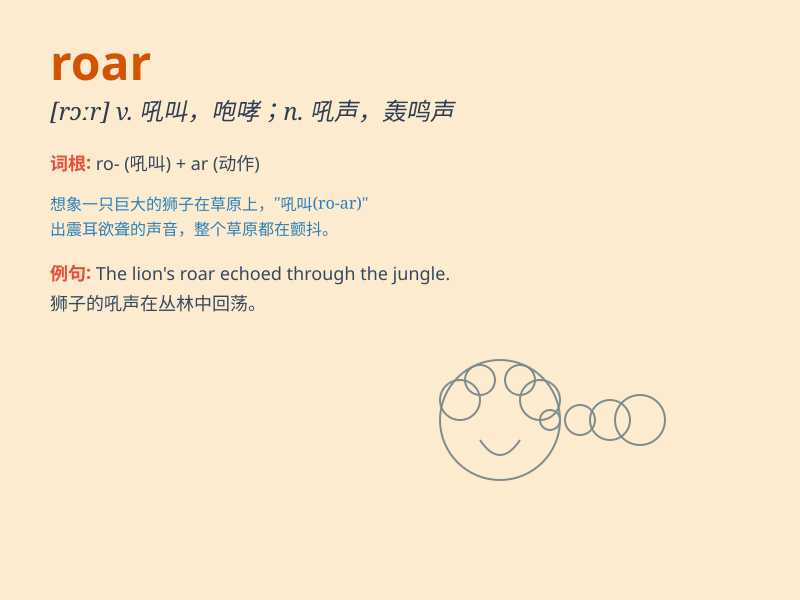

## roar

**英音:** _[rɔː]_ **美音:** _[rɔr]_

**译义:** *n.吼叫,怒号vi.吼叫,怒号v.滚动,咆哮*

### 短语

+ **roar with laughter:** _哄堂大笑_

+ **roar out:** _大声喊出_

+ **roar past:** _呼啸而过_

+ **roar away:** _轰鸣着离去_

+ **roar up:** _突然大声起来_

### 例句

#### 例句1

> **The lion let out a roar that echoed through the jungle.**

**中文翻译:** 狮子发出一声吼叫，在丛林中回荡。

**单词释义:** 咆哮（指狮子发出的大声吼叫）

#### 例句2

> **The engine of the race car roared as it sped along the track.**

**中文翻译:** 赛车的引擎轰鸣着，沿着赛道疾驰。

**单词释义:** 轰鸣（形容发动机的大声响声）

#### 例句3

> **The crowd roared with excitement when the home team scored.**

**中文翻译:** 当主队进球时，全场欢呼雀跃。

**单词释义:** 欢呼（指人群发出的大声呼喊）

### 背诵小故事

> A lion was sleeping in the forest. Suddenly, a hunter appeared and
disturbed it. The angry lion let out a powerful roar that echoed through
the trees. The roar was so loud that it scared the hunter away.

**一只狮子正在森林里睡觉。突然，一个猎人出现并打扰了它。愤怒的狮子发出了强大的吼声，在树林中回荡。这吼声如此响亮，把猎人吓跑了。**

### 图义

