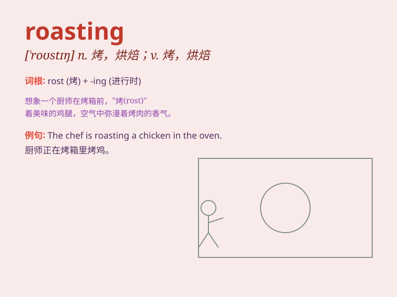

## roasting

**英音:** _[ˈrəʊstɪŋ]_ **美音:** _[ˈroʊstɪŋ]_

**译义:** *n.烤制，烘烤；被严厉批评；adj.炙热的，被烘烤过的；v.烤(
roast的ing形式 )*

### 短语

+ **roasting hot:** _酷热的；灼热的_

+ **do a roasting:** _严厉批评；痛斥_

+ **roasting pan:** _烤盘_

+ **roasting spit:** _烤肉叉_

+ **take a roasting:** _遭到严厉批评；受到痛斥_

### 例句

#### 例句1

> **The sun was roasting us as we walked along the beach.**

**中文翻译:** 当我们沿着海滩散步时，太阳把我们烤得难受。

**单词释义:** 烘烤；暴晒

#### 例句2

> **She gave him a roasting for being late again.**

**中文翻译:** 她因为他又迟到狠狠地训斥了他一顿。

**单词释义:** 严厉批评；斥责

#### 例句3

> **The chicken is roasting in the oven.**

**中文翻译:** 鸡正在烤箱里烤着。

**单词释义:** 烤

### 背诵小故事

> One hot summer day, I was at a barbecue. The chef was roasting
delicious chicken. The heat made him sweat, but the smell of the
roasting meat was so inviting. Everyone was waiting impatiently for the
roasting to finish.

**在一个炎热的夏日，我在一场烧烤活动中。厨师正在烤美味的鸡肉。高温让他汗流浃背，但烤肉的香味太诱人了。每个人都迫不及待地等着烤好。**

### 图义

