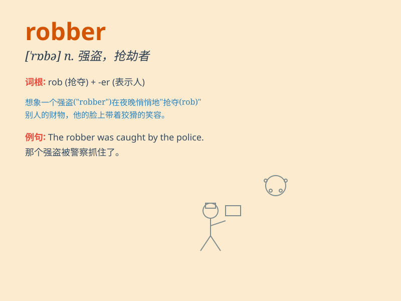

## robber

**英音:** _[\'rɒbə]_ **美音:** _[\'rɑbɚ]_

**译义:** *n.强盗,盗贼*

### 短语

+ **armed robber:** _武装强盗_

+ **petty robber:** _小偷小摸的强盗_

+ **habitual robber:** _惯匪_

+ **notorious robber:** _臭名昭著的强盗_

+ **bank robber:** _银行劫匪_

### 例句

#### 例句1

> **The robber was caught by the police.**

**中文翻译:** 强盗被警察抓获。

**单词释义:** 强盗

#### 例句2

> **The frightened woman screamed when she saw the robber.**

**中文翻译:** 当看到强盗时，受惊的女人尖叫起来。

**单词释义:** 强盗

#### 例句3

> **The robber broke into the house and stole a lot of valuable
things.**

**中文翻译:** 强盗闯进了房子，偷走了很多值钱的东西。

**单词释义:** 强盗

### 背诵小故事

> One night, a man wearing a mask broke into a house. He took away
valuable things. This man was a robber. The owner called the police to
catch him.

**一天晚上，一个戴着面具的男人闯进了一所房子。他拿走了贵重的东西。这个男人是个强盗。房子的主人报了警要抓住他。**

### 图义

