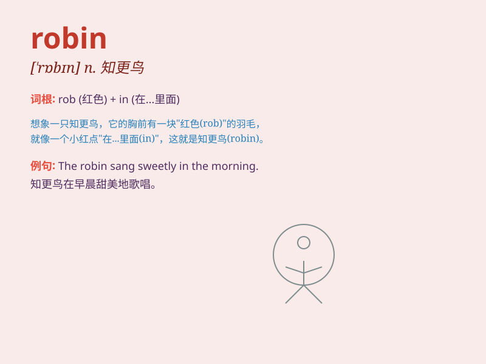

## robin

**英音:** _[\'rɒbɪn]_ **美音:** _[\'rɑbɪn]_

**译义:** *n.[鸟]知更鸟 Robin 罗宾(男子名)*

### 短语

+ **American robin:** _美洲知更鸟_

+ **robin redbreast:** _欧亚鸲；知更鸟_

+ **Robin Hood:** _罗宾汉（英国民间传说中劫富济贫的侠盗）_

+ **Robin\'s egg blue:** _知更鸟蛋蓝；浅蓝色_

+ **winter robin:** _冬鸲_

### 例句

#### 例句1

> **The robin is a common bird in our garden.**

**中文翻译:** 知更鸟是我们花园里常见的鸟类。

**单词释义:** 知更鸟

#### 例句2

> **I saw a robin hopping on the grass.**

**中文翻译:** 我看见一只知更鸟在草地上跳跃。

**单词释义:** 知更鸟

#### 例句3

> **The robin\'s song is very beautiful in the morning.**

**中文翻译:** 早晨知更鸟的歌声非常动听。

**单词释义:** 知更鸟

### 背诵小故事

> Robin
是一只聪明的知更鸟，它每天都会在森林里寻找最美味的虫子。有一天，它迷路了，但凭借着出色的方向感，最终找到了回家的路。

**罗宾是一只聪明的知更鸟，它每天在森林找美味虫子，某天迷路，靠出色方向感最终回家。**

### 图义

