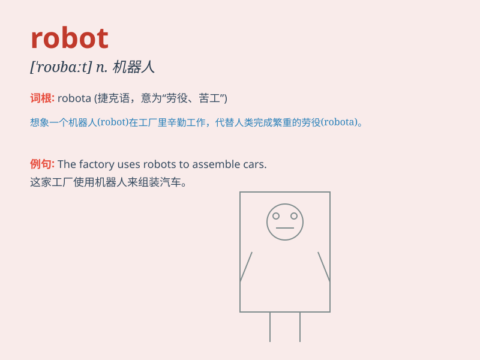

## robot

**英音:** _[\'rəʊbɒt]_ **美音:** _[\'robɑt]_

**译义:** *n.机器人,遥控设备,自动机械,机械般工作的人*

### 短语

+ **industrial robot:** _工业机器人_

+ **humanoid robot:** _人形机器人_

+ **service robot:** _服务机器人_

+ **domestic robot:** _家用机器人_

+ **robotic arm:** _机械臂；机器人手臂_

### 例句

#### 例句1

> **The robot can perform complex tasks with high precision.**

**中文翻译:** 该机器人可以高精度地执行复杂的任务。

**单词释义:** 机器人

#### 例句2

> **In the future, robots may replace many human workers.**

**中文翻译:** 未来，机器人可能会取代很多人类工人。

**单词释义:** 机器人

#### 例句3

> **The children were fascinated by the robot at the science
exhibition.**

**中文翻译:** 孩子们对科学展览上的机器人着迷。

**单词释义:** 机器人

### 背诵小故事

> One day, a little boy was lost in a strange city. Suddenly, a robot
appeared and guided him home. The robot had a shiny body and could talk
and move freely. The boy was so happy to have met this helpful robot.

**有一天，一个小男孩在陌生的城市迷路了。突然，一个机器人出现并引导他回家。这个机器人有着闪亮的身体，能说话和自由移动。小男孩很高兴遇到了这个乐于助人的机器人。**

### 图义

