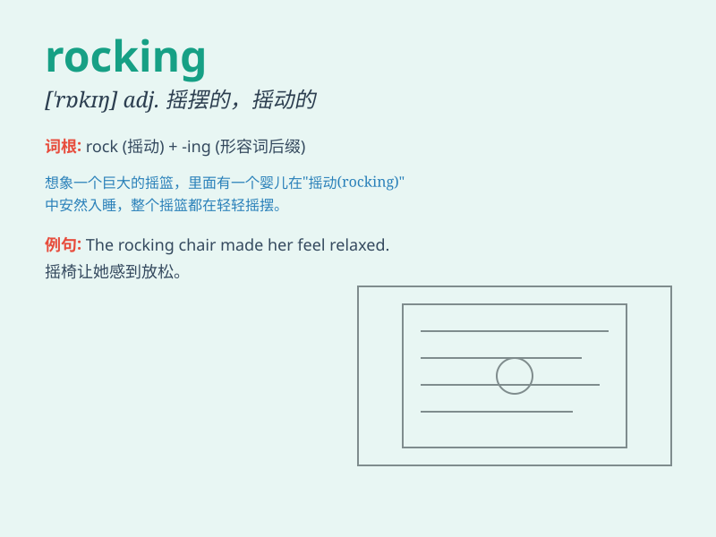

## rocking

**英音:** _[\'rɒkɪŋ]_ **美音:** _[\'rɑkɪŋ]_

**译义:** *adj.摇摆的,摇动的*

### 短语

+ **rocking chair:** _摇椅_

+ **rocking horse:** _木马；摇摆木马_

+ **keep rocking:** _继续摇摆；保持出色_

+ **start rocking:** _开始摇摆；开始活跃_

+ **rocking motion:** _摇摆运动；晃动_

### 例句

#### 例句1

> **The boat was rocking gently on the waves.**

**中文翻译:** 小船在海浪中轻轻摇晃。

**单词释义:** 摇晃

#### 例句2

> **She was rocking the baby to sleep in her arms.**

**中文翻译:** 她摇晃着怀里的婴儿，让他睡着。

**单词释义:** 轻轻摇动

#### 例句3

> **The rocking chair creaked as he sat down.**

**中文翻译:** 当他坐下时，摇椅吱吱作响。

**单词释义:** 摇动的

### 背诵小故事

> One day, I was on a boat. The waves were big and the boat was
rocking. I felt very scared. But then I saw a beautiful rainbow and
forgot my fear. Rocking here means moving back and forth or side to
side.

**有一天，我在一艘船上。海浪很大，船在摇晃。我感到非常害怕。但随后我看到了一道美丽的彩虹，忘记了恐惧。这里的
rocking 意思是来回或左右移动。**

### 图义

