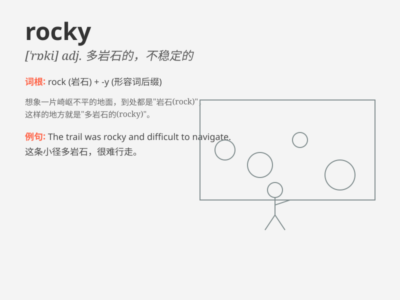

## rocky

**英音:** _[\'rɒkɪ]_ **美音:** _[\'rɑki]_

**译义:**
*adj.多岩石的,坚如岩石的,坚固的,摇摇晃晃的,头晕目眩的,困难的*

### 短语

+ **rocky road:** _困难重重的道路；坎坷的道路_

+ **rocky terrain:** _多岩石的地形；崎岖的地形_

+ **rocky coastline:** _岩石嶙峋的海岸线_

+ **rocky relationship:** _不稳定的关系；充满波折的关系_

+ **rocky start:** _艰难的开端；不顺利的开始_

### 例句

#### 例句1

> **The road to the village is very rocky.**

**中文翻译:** 通往村子的路非常崎岖。

**单词释义:** 多岩石的；崎岖不平的

#### 例句2

> **Their relationship has been rocky recently.**

**中文翻译:** 他们的关系最近很不稳定。

**单词释义:** 不稳定的；困难重重的

#### 例句3

> **The rocky terrain made it difficult for us to hike.**

**中文翻译:** 崎岖的地形使我们徒步旅行变得困难。

**单词释义:** 多岩石的

### 背诵小故事

> A brave climber was trying to reach the top of a mountain. The path
was rocky and full of challenges. But he didn\'t give up and finally
made it. Rocky means full of rocks or uneven.

**一位勇敢的登山者试图到达山顶。道路崎岖不平，充满挑战。但他没有放弃，最终成功了。rocky
意思是多岩石的；崎岖不平的。**

### 图义

