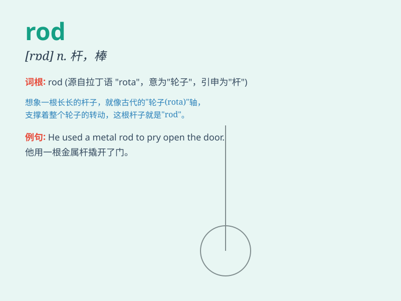

## rod

**英音:** _[rɒd]_ **美音:** _[rɑd]_

**译义:** *n.杆,棒*

### 短语

+ **fishing rod:** _钓竿_

+ **metal rod:** _金属棒_

+ **measuring rod:** _测量杆_

+ **lightning rod:** _避雷针_

+ **rodding eye:** _疏通孔_

### 例句

#### 例句1

> **He used a fishing rod to catch fish in the river.**

**中文翻译:** 他用一根钓鱼竿在河里钓鱼。

**单词释义:** 竿；杆；棒

#### 例句2

> **The piston rod moved up and down smoothly.**

**中文翻译:** 活塞杆上下运动平稳。

**单词释义:** 杆；棒

#### 例句3

> **She was punished with the rod for her bad behavior.**

**中文翻译:** 她因为她的不良行为而受到了棍棒的惩罚。

**单词释义:** 棍棒

### 背诵小故事

> A fisherman lost his rod while fishing. He searched everywhere but
couldn\'t find it. Later, he saw a light and found his rod under a big
rock. The rod helped him catch many fish.

**一位渔夫在钓鱼时弄丢了他的鱼竿。他到处找都没找到。后来，他看到一束光，在一块大石头下找到了他的鱼竿。这根鱼竿帮他钓到了很多鱼。**

### 图义

