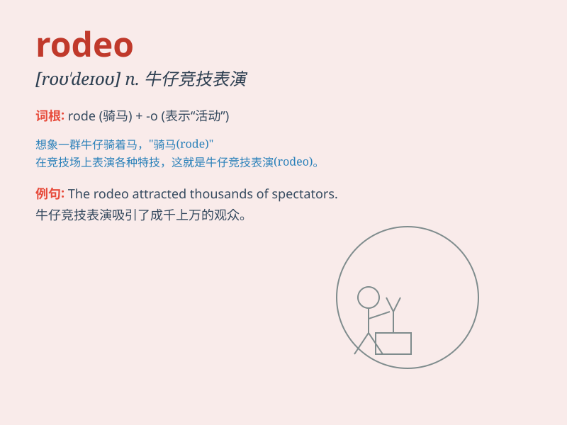

## rodeo

**英音:** _[\'rəʊdɪəʊ; rə(ʊ)\'deɪəʊ]_ **美音:**
_[\'rodɪo]_

**译义:** *n.\<美> 为打烙印而赶拢牧牛,牛仔竞技表演vi.\<美>
参加竞技*

### 短语

+ **rodeo clown:** _牛仔竞技表演中的小丑_

+ **rodeo rider:** _牛仔竞技骑手_

+ **rodeo arena:** _牛仔竞技表演场_

+ **rodeo event:** _牛仔竞技项目_

+ **rodeo championship:** _牛仔竞技锦标赛_

### 例句

#### 例句1

> **He went to the rodeo to watch the cowboys show off their
skills.**

**中文翻译:** 他去牛仔竞技表演观看牛仔们展示他们的技能。

**单词释义:** 牛仔竞技表演

#### 例句2

> **The rodeo attracted thousands of spectators.**

**中文翻译:** 牛仔竞技表演吸引了数千名观众。

**单词释义:** 牛仔竞技表演

#### 例句3

> **She has always been fascinated by the excitement of the
rodeo.**

**中文翻译:** 她一直对牛仔竞技表演的兴奋感着迷。

**单词释义:** 牛仔竞技表演

### 背诵小故事

> One day, Tom went to a rodeo. He saw cowboys riding wild horses and
doing amazing tricks. The excitement of the rodeo made him never forget
this word.

**有一天，汤姆去了一个牛仔竞技表演。他看到牛仔们骑着野马并表演惊人的特技。牛仔竞技的兴奋让他永远记住了rodeo这个词。**

### 图义

