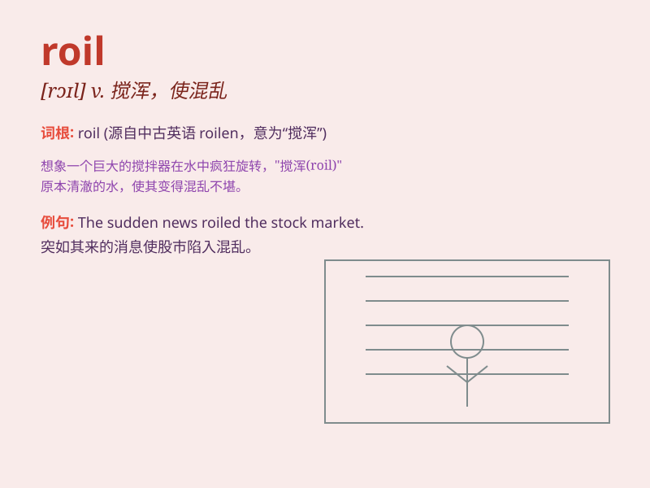

## roil

**英音:** _[rɔɪl]_ **美音:** _[rɔɪl]_

**译义:** *vt.煽动,激怒*

### 短语

+ **roil the waters:** _把水搅浑；制造混乱_

+ **roil with anger:** _愤怒不已_

+ **roil the market:** _扰乱市场_

+ **roil one\'s stomach:** _使某人胃不舒服_

+ **roil in confusion:** _在困惑中挣扎_

### 例句

#### 例句1

> **The political scandal roiled the country.**

**中文翻译:** 这起政治丑闻震惊了全国。

**单词释义:** 使动荡；使混乱

#### 例句2

> **The river roiled and foamed as the storm approached.**

**中文翻译:** 暴风雨临近时，河水翻滚，泛起白沫。

**单词释义:** （水）翻滚；激荡

#### 例句3

> **His angry words roiled the meeting.**

**中文翻译:** 他的愤怒言论搅乱了会议。

**单词释义:** 搅乱；使烦躁

### 背诵小故事

>
想象一下，在一个平静的池塘边，有个调皮的孩子不断扔石头，搅动（roil）了池水，让原本清澈平静的水面变得浑浊混乱。就像这个场景一样，roil
就是指搅乱、使动荡。

**想象孩子扔石头搅乱池塘的场景来记住 roil 表示搅乱、使动荡的意思**

### 图义

