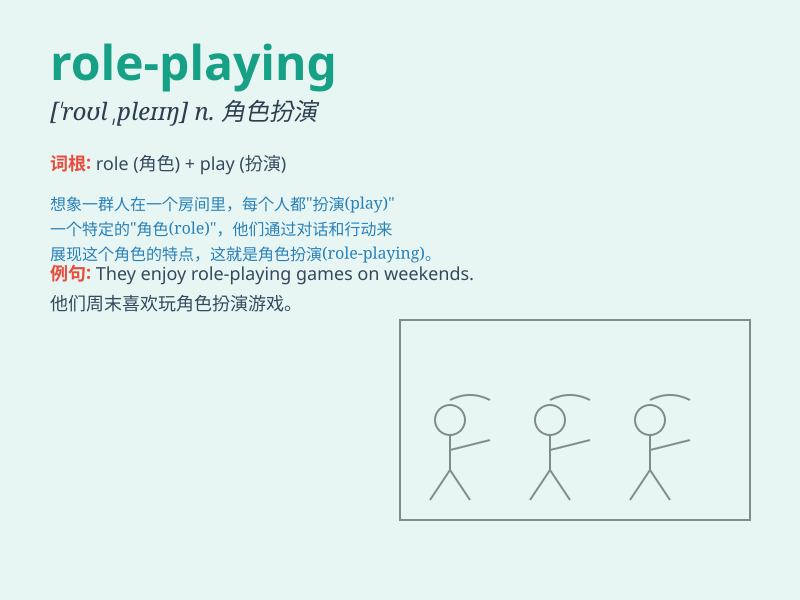

## role-playing

**英音:** _[ˈroʊl ˌpleɪɪŋ]_ **美音:** _[ˈroʊl ˌpleɪɪŋ]_

**译义:**
*n.角色扮演；角色扮演游戏（通常指玩家扮演虚构角色并参与故事情节的游戏）*

### 短语

+ **role-playing game:** _角色扮演游戏_

+ **role-playing exercise:** _角色扮演练习_

+ **role-playing session:** _角色扮演环节_

+ **role-playing technique:** _角色扮演技巧_

+ **role-playing activity:** _角色扮演活动_

### 例句

#### 例句1

> **I enjoy role-playing games where I can create my own
character.**

**中文翻译:** 我喜欢角色扮演游戏，在那里我可以创建自己的角色。

**单词释义:** 角色扮演

#### 例句2

> **The students did a role-playing activity to practice English
conversations.**

**中文翻译:** 学生们进行了角色扮演活动来练习英语对话。

**单词释义:** 角色扮演

#### 例句3

> **Role-playing is a useful teaching method in language
learning.**

**中文翻译:** 角色扮演在语言学习中是一种有用的教学方法。

**单词释义:** 角色扮演

### 背诵小故事

> Once upon a time, in a magical land, a group of friends were engaged
in role-playing. They pretended to be wizards and warriors, each taking
on a special role. It was so much fun and they really enjoyed the
experience of role-playing.

**从前，在一片神奇的土地上，一群朋友在进行角色扮演。他们假装是巫师和战士，每个人都承担着一个特殊的角色。这太有趣了，他们真的很享受角色扮演的体验。**

### 图义

