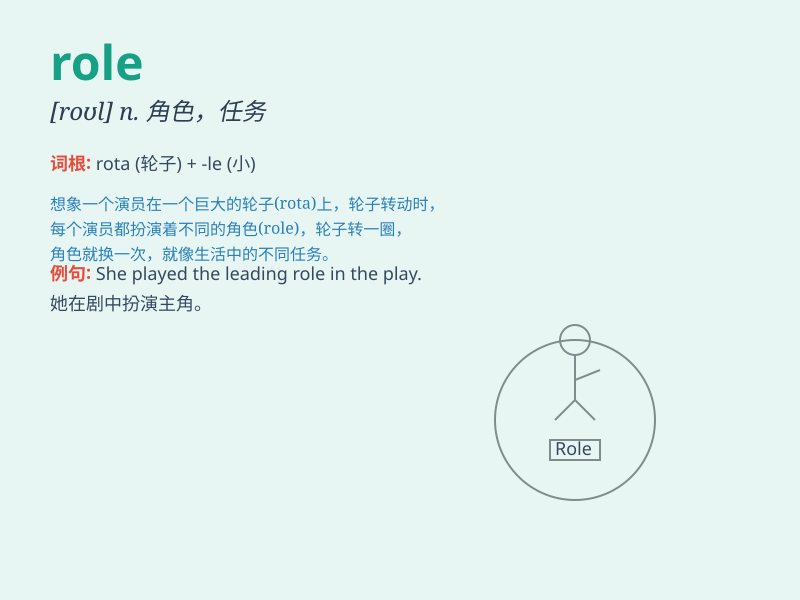

## role

**英音:** _[rəʊl]_ **美音:** _[rol]_

**译义:** *n.角色,任务*

### 短语

+ **play a role:** _起作用；扮演角色_

+ **leading role:** _主角；主导作用_

+ **key role:** _关键作用；关键角色_

+ **supporting role:** _配角；支持作用_

+ **role model:** _榜样；模范_

### 例句

#### 例句1

> **She played the role of a doctor in the play.**

**中文翻译:** 她在剧中饰演一名医生。

**单词释义:** 角色

#### 例句2

> **The role of parents is crucial in a child\'s development.**

**中文翻译:** 父母的角色对于孩子的成长至关重要。

**单词释义:** 角色；作用

#### 例句3

> **He has taken on a new role in the company.**

**中文翻译:** 他在公司担任新职务。

**单词释义:** 职务；职责

### 背诵小故事

> A young actor was very nervous before his first performance. But when
he remembered his role as a brave hero, he gained confidence and gave a
wonderful show. The role defined his actions and made him shine.

**一位年轻的演员在他的首次表演前非常紧张。但当他想起自己作为勇敢英雄的角色时，他获得了信心并带来了精彩的演出。这个角色决定了他的行为并让他大放异彩。**

### 图义

