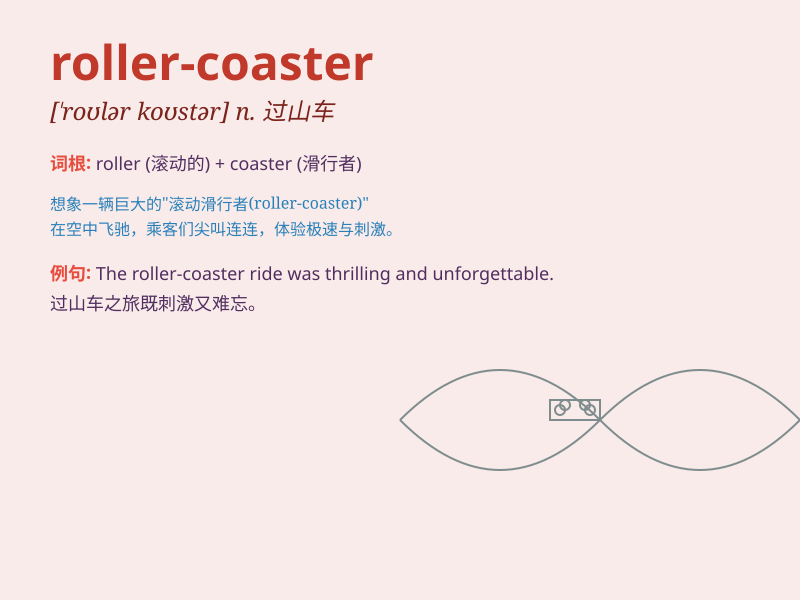

## roller-coaster

**英音:** _[ˈrəʊlə ˈkəʊstə]_ **美音:** _[ˈroʊlər
koʊstər]_

**译义:** *n. 过山车；（生活或事业上的）大起大落*

### 短语

+ **roller-coaster ride:** _过山车之旅；跌宕起伏的经历_

+ **roller-coaster emotions:** _大起大落的情绪_

+ **roller-coaster track:** _过山车轨道_

+ **roller-coaster industry:** _过山车产业_

+ **roller-coaster speed:** _过山车的速度_

### 例句

#### 例句1

> **The roller-coaster ride was thrilling and full of excitement.**

**中文翻译:** 这次过山车之旅令人兴奋，充满了刺激。

**单词释义:** 过山车

#### 例句2

> **Her emotions have been on a roller-coaster since she got the
news.**

**中文翻译:**
自从她得到这个消息以来，她的情绪就像坐过山车一样起伏不定。

**单词释义:** 像过山车一样起伏不定的经历或状况

#### 例句3

> **The stock market has been a roller-coaster this year.**

**中文翻译:** 今年的股市像过山车一样波动。

**单词释义:** 像过山车一样波动的（市场等）

### 背诵小故事

> Once upon a time, I went to an amusement park. I was so excited to
ride the roller-coaster. It went up and down, fast and slow, giving me a
thrilling experience.

**从前，我去了一个游乐园。我非常兴奋地去坐过山车。它上下起伏，时快时慢，给了我一次惊心动魄的体验。**

### 图义

