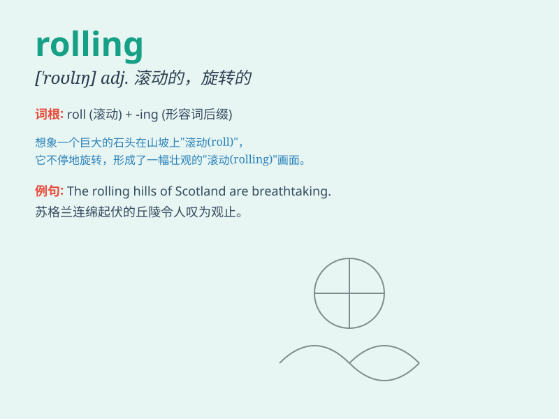

## rolling

**英音:** _[\'rəʊlɪŋ]_ **美音:** _[\'rolɪŋ]_

**译义:** *adj.旋转的,转动的,摇摆的,起伏的n.旋转,翻滚,动摇*

### 短语

+ **rolling hills:** _起伏的山丘_

+ **rolling stock:** _铁路车辆_

+ **rolling pin:** _擀面杖_

+ **rolling stone:** _滚石；居无定所的人_

+ **rolling thunder:** _滚动的雷声_

### 例句

#### 例句1

> **The rolling hills in the countryside are very beautiful.**

**中文翻译:** 乡村连绵起伏的山峦非常美丽。

**单词释义:** 起伏的

#### 例句2

> **The rolling stones gathered no moss.**

**中文翻译:** 滚石不长青苔。

**单词释义:** 滚动的

#### 例句3

> **The ship was rolling heavily in the stormy sea.**

**中文翻译:** 船在惊涛骇浪中沉重地摇晃。

**单词释义:** 摇晃

### 背诵小故事

> A little monkey was rolling down a hill, laughing happily. It kept
rolling and rolling until it reached the bottom. The monkey\'s rolling
adventure was so funny!

**一只小猴子正从山上滚下来，开心地笑着。它不停地滚啊滚，一直滚到了山底。猴子的滚动冒险太有趣啦！**

### 图义

