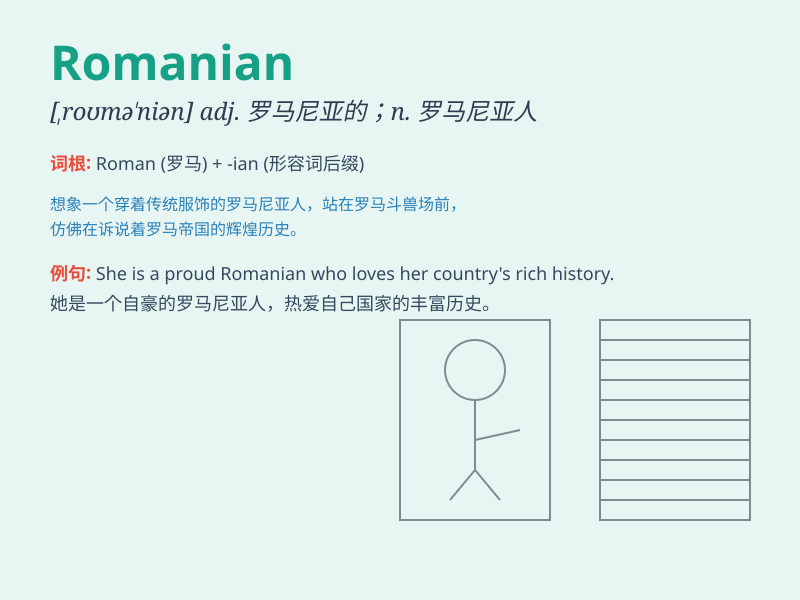

## Romanian

**英音:** _[rəʊˈmeɪnɪən]_ **美音:** _[roʊˈmeɪniən]_

**译义:** *adj. 罗马尼亚的；罗马尼亚人的；n.
罗马尼亚人；罗马尼亚语*

### 短语

+ **Romanian language:** _罗马尼亚语_

+ **Romanian cuisine:** _罗马尼亚美食_

+ **Romanian history:** _罗马尼亚历史_

+ **Romanian culture:** _罗马尼亚文化_

+ **Romanian literature:** _罗马尼亚文学_

### 例句

#### 例句1

> **She is learning Romanian for her upcoming trip to Bucharest.**

**中文翻译:** 她正在为即将到来的布加勒斯特之行学习罗马尼亚语。

**单词释义:** 罗马尼亚语

#### 例句2

> **The Romanian flag has three colors: blue, yellow, and red.**

**中文翻译:** 罗马尼亚国旗有三种颜色：蓝色、黄色和红色。

**单词释义:** 罗马尼亚的；罗马尼亚人的

#### 例句3

> **We met some friendly Romanians at the party.**

**中文翻译:** 我们在聚会上遇到了一些友好的罗马尼亚人。

**单词释义:** 罗马尼亚人

### 背诵小故事

> Once upon a time, I met a traveler from a faraway land. He introduced
himself as being from Romania and said they are called \'Romanian\'. I
remembered this word easily because of his friendly smile and unique
accent.

**从前，我遇到一位来自遥远地方的旅行者。他自我介绍来自罗马尼亚，并说他们被称为"罗马尼亚人"。因为他友好的微笑和独特的口音，我很容易就记住了这个词。**

### 图义

