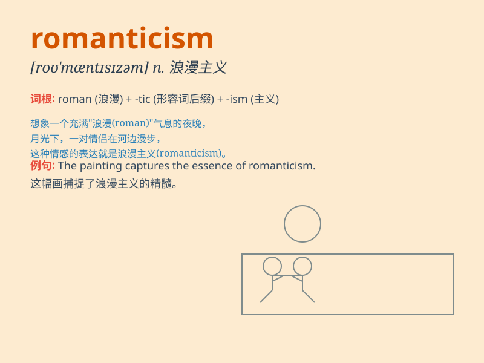

## romanticism

**英音:** _[rə(ʊ)\'mæntɪsɪz(ə)m]_ **美音:**
_[ro\'mæntə\'sɪzəm]_

**译义:** *n.浪漫精神,浪漫主义*

### 短语

+ **European romanticism:** _欧洲浪漫主义_

+ **literary romanticism:** _文学浪漫主义_

+ **Romanticism movement:** _浪漫主义运动_

+ **artistic romanticism:** _艺术浪漫主义_

+ **musical romanticism:** _音乐浪漫主义_

### 例句

#### 例句1

> **The novel is filled with romanticism and adventure.**

**中文翻译:** 小说充满了浪漫主义和冒险色彩。

**单词释义:** 浪漫主义

#### 例句2

> **Romanticism was a major artistic and literary movement in the
19th century.**

**中文翻译:** 浪漫主义是19世纪一场重要的艺术和文学运动。

**单词释义:** 浪漫主义

#### 例句3

> **Her paintings show a touch of romanticism.**

**中文翻译:** 她的画作带有一丝浪漫主义色彩。

**单词释义:** 浪漫主义

### 背诵小故事

> A painter was always drawn to nature\'s beauty. He loved painting
sunsets and starry nights, expressing intense emotions. This passion for
the ideal and the emotional was his romanticism. It made his art alive
and touching.

**一位画家总是被大自然的美所吸引。他喜欢画日落和繁星点点的夜晚，表达强烈的情感。这种对理想和情感的热情就是他的浪漫主义。这让他的艺术作品充满生机且动人。**

### 图义

