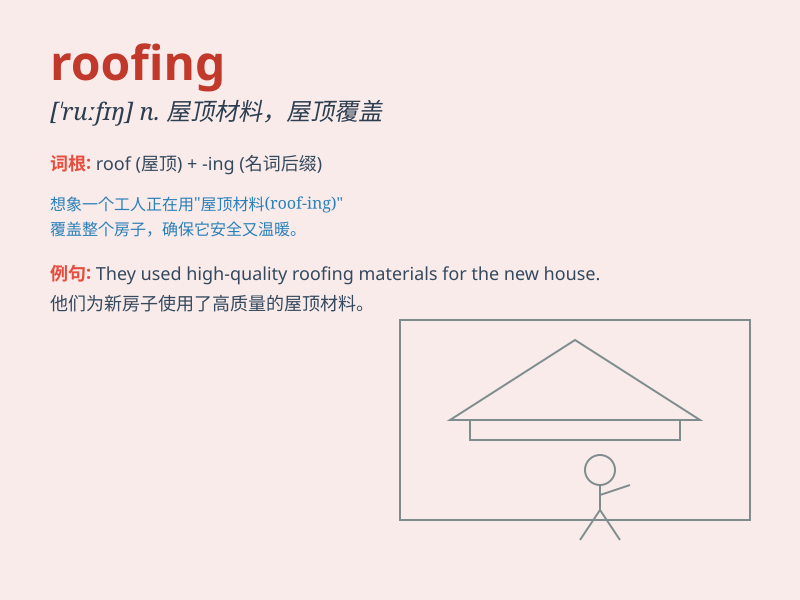

## roofing

**英音:** _[\'ruːfɪŋ]_ **美音:** _[\'rʊfɪŋ]_

**译义:** *n.屋顶盖法*

### 短语

+ **roofing material:** _屋面材料_

+ **roofing contractor:** _屋顶承包商_

+ **metal roofing:** _金属屋面_

+ **roofing shingle:** _屋顶木瓦_

+ **flat roofing:** _平屋顶_

### 例句

#### 例句1

> **The roofing of this house needs to be repaired.**

**中文翻译:** 这所房子的屋顶需要修理。

**单词释义:** 屋顶（材料）；盖屋顶

#### 例句2

> **He is an expert in roofing installation.**

**中文翻译:** 他是屋顶安装方面的专家。

**单词释义:** 屋顶（材料）；盖屋顶

#### 例句3

> **The cost of roofing for the new building is quite high.**

**中文翻译:** 新建筑的屋顶成本相当高。

**单词释义:** 屋顶（材料）；盖屋顶

### 背诵小故事

> One day, a little bird was looking for a safe place. It flew over
many houses and noticed the roofing. The colorful and strong roofing
protected people from rain and wind. The bird thought it was amazing.

**有一天，一只小鸟在寻找安全的地方。它飞过许多房子，注意到了屋顶。色彩鲜艳且坚固的屋顶为人们遮风挡雨。小鸟觉得这太神奇了。**

### 图义

