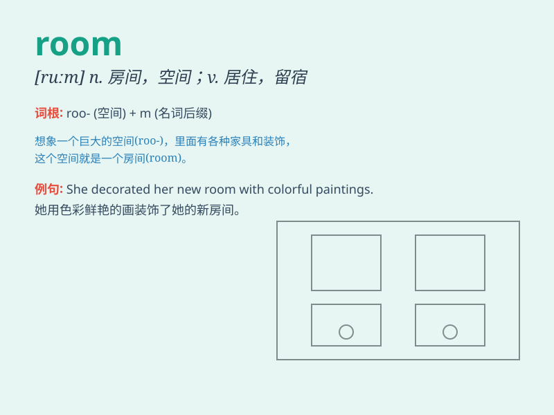

## room

**英音:** _[ruːm; rʊm]_ **美音:** _[rum]_

**译义:** *n.房间,屋子,寓所,场所,地位,空间,机会,余地*

### 短语

+ **living room:** _客厅；起居室_

+ **bedroom:** _卧室_

+ **dining room:** _餐厅_

+ **conference room:** _会议室_

+ **classroom:** _教室_

### 例句

#### 例句1

> **There is no room for mistakes in this exam.**

**中文翻译:** 这次考试不允许有任何错误。

**单词释义:** 空间；余地

#### 例句2

> **The hotel room was very clean and comfortable.**

**中文翻译:** 酒店房间非常干净舒适。

**单词释义:** 房间

#### 例句3

> **I need some room to think.**

**中文翻译:** 我需要一些思考的空间。

**单词释义:** 空间；地方

### 背诵小故事

> One day, a little mouse was looking for a safe place. It found a room
with a big bed and a warm blanket. The mouse was very happy and said,
\'This room is my perfect hideout!\'

**有一天，一只小老鼠正在寻找一个安全的地方。它发现了一个房间，里面有一张大床和一条温暖的毯子。小老鼠非常高兴，说：'这个房间是我完美的藏身之处！'**

### 图义

