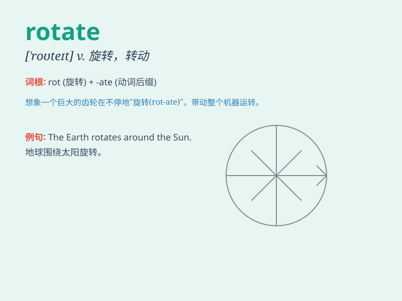

## rotate

**英音:** _[rə(ʊ)\'teɪt]_ **美音:** _[\'rotet]_

**译义:** *v.(使)旋转 /v.旋转/翻转*

### 短语

+ **rotate around:** _围绕\...\...旋转_

+ **rotate in:** _转入_

+ **rotate through:** _通过\...\...旋转_

+ **rotate constantly:** _不断旋转_

+ **rotate slowly:** _缓慢旋转_

### 例句

#### 例句1

> **The wheels of the car rotate rapidly.**

**中文翻译:** 汽车的车轮快速旋转。

**单词释义:** （使）旋转；（使）转动

#### 例句2

> **It\'s your turn to rotate the bottle.**

**中文翻译:** 轮到你旋转瓶子了。

**单词释义:** （使）旋转；（使）转动

#### 例句3

> **The earth rotates around the sun.**

**中文翻译:** 地球绕太阳旋转。

**单词释义:** （使）旋转；（使）转动

### 背诵小故事

> 想象一个巨大的摩天轮（Ferris
wheel），它不停地转动（rotate）。每个座舱都沿着圆形轨道移动，就像指针在表盘上旋转一样。人们坐在里面，随着摩天轮的转动欣赏着不同的风景。

**想象一个巨大的摩天轮不停地转动。每个座舱都沿着圆形轨道移动，人们坐在里面欣赏风景来辅助记忆
rotate 这个单词**

### 图义

