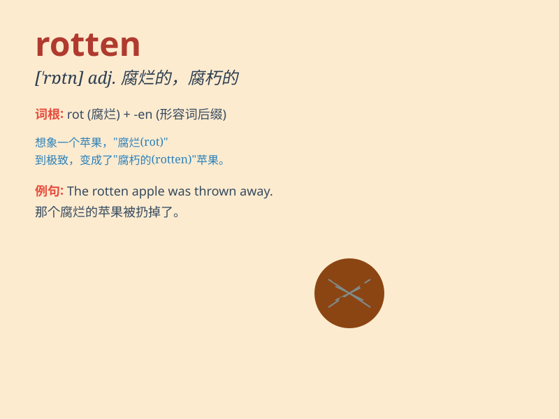

## rotten

**英音:** _[\'rɒt(ə)n]_ **美音:** _[\'rɑtn]_

**译义:** *adj.腐烂的,恶臭的,堕落的,(岩石等)风化的,虚弱的,无用的*

### 短语

+ **rotten apple:** _坏家伙；害群之马_

+ **rotten egg:** _坏蛋；讨厌的人_

+ **rotten luck:** _倒霉；运气不佳_

+ **rotten teeth:** _蛀牙；龋齿_

+ **rotten weather:** _恶劣的天气；糟糕的天气_

### 例句

#### 例句1

> **The fruit was rotten and smelled terrible.**

**中文翻译:** 水果已经腐烂，散发出难闻的气味。

**单词释义:** 腐烂的

#### 例句2

> **The wood was rotten and couldn\'t be used for building.**

**中文翻译:** 木头已经腐烂，不能用来建造。

**单词释义:** 腐烂的；腐朽的

#### 例句3

> **His behavior was rotten and unacceptable.**

**中文翻译:** 他的行为是恶劣的、令人无法接受的。

**单词释义:** 恶劣的；糟糕的

### 背诵小故事

> One day, Tom went to an old house. He opened a cupboard and found
some apples. But they smelled terrible. They were rotten. Tom quickly
threw them away.

**有一天，汤姆去了一间老房子。他打开一个橱柜，发现了一些苹果。但它们闻起来很糟糕。它们都腐烂了。汤姆赶紧把它们扔掉了。**

### 图义

