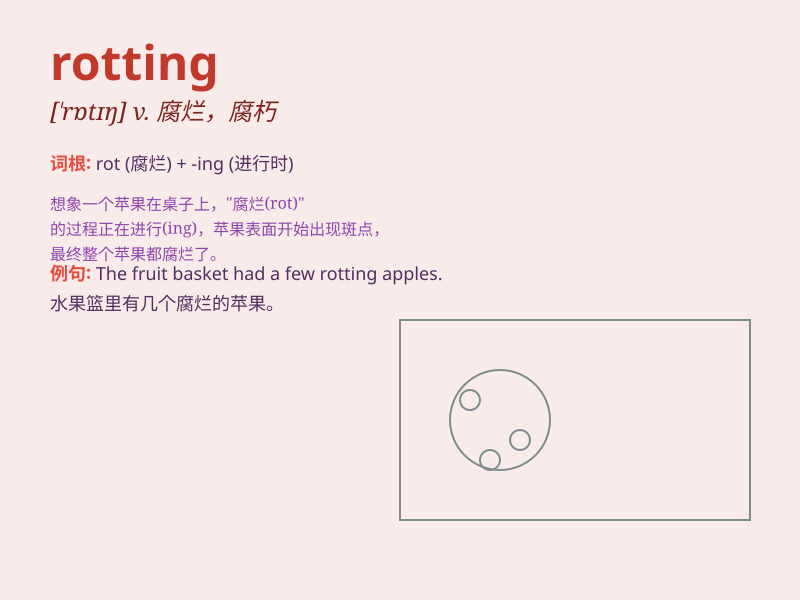

## rotting

**英音:** _[ˈrɒtɪŋ]_ **美音:** _[ˈrɑːtɪŋ]_

**译义:** *v. 腐烂，腐朽（rot
的现在分词）；衰退，衰败；堕落，变坏（品质、价值等）*

### 短语

+ **rotting fruit:** _腐烂的水果_

+ **rotting wood:** _腐朽的木头_

+ **rotting garbage:** _腐烂的垃圾_

+ **rotting corpse:** _腐烂的尸体_

+ **rotting leaves:** _腐烂的树叶_

### 例句

#### 例句1

> **The rotting fruit emitted a foul smell.**

**中文翻译:** 腐烂的水果发出一股难闻的气味。

**单词释义:** 腐烂的

#### 例句2

> **The old house was surrounded by rotting wood.**

**中文翻译:** 这座老房子被腐烂的木头环绕着。

**单词释义:** 腐烂的

#### 例句3

> **The rotting leaves covered the ground.**

**中文翻译:** 腐烂的树叶覆盖着地面。

**单词释义:** 腐烂的

### 背诵小故事

> A brave adventurer entered an abandoned house. The smell was awful.
He followed it and found a room full of rotting fruits and vegetables.
The sight was so disgusting! It made him understand the meaning of
\'rotting\' - decaying and spoiling.

**一位勇敢的探险家进入了一座废弃的房子。气味很难闻。他顺着气味，发现了一个满是腐烂的水果和蔬菜的房间。这景象太恶心了！这让他明白了'rotting'的意思------正在腐朽和变质。**

### 图义

