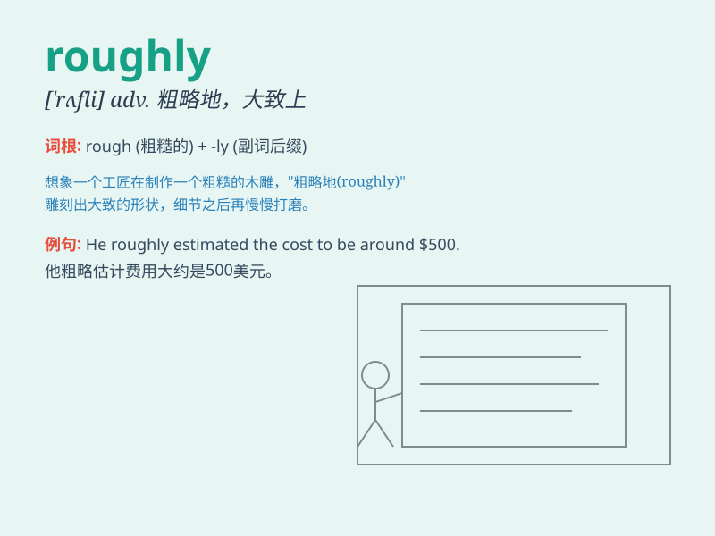

## roughly

**英音:** _[\'rʌflɪ]_ **美音:** _[\'rʌfli]_

**译义:** *adv.概略地,粗糙地*

### 短语

+ **roughly speaking:** _粗略地说；大致说来_

+ **roughly equal:** _大致相等_

+ **roughly estimated:** _粗略估计_

+ **roughly the same:** _大致相同_

+ **roughly handled:** _粗暴对待_

### 例句

#### 例句1

> **The work was roughly done and needed to be refined.**

**中文翻译:** 这项工作做得很粗糙，需要改进。

**单词释义:** 粗略地；粗糙地

#### 例句2

> **He estimated the distance roughly at 50 miles.**

**中文翻译:** 他粗略估计距离约为 50 英里。

**单词释义:** 大约；大致

#### 例句3

> **She treated him roughly when she was in a bad mood.**

**中文翻译:** 她心情不好的时候对他很粗暴。

**单词释义:** 粗暴地；粗鲁地

### 背诵小故事

> Once upon a time, a traveler was lost in a forest. The path was
roughly marked, making it hard for him to find the right way. But
finally, with perseverance, he got out. Remember, \'roughly\' means
approximately or not precisely.

**从前，有一位旅行者在森林里迷路了。道路标记得很粗略，这让他很难找到正确的路。但最终，凭借毅力，他走了出来。记住，'roughly'意思是大约、大致、粗略地。**

### 图义

