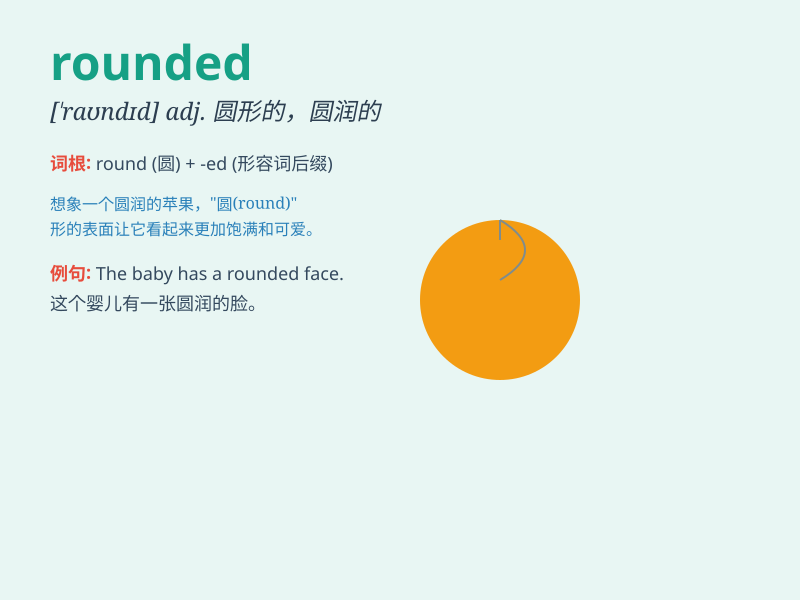

## rounded

**英音:** _[\'raʊndɪd]_ **美音:** _[\'raʊndɪd]_

**译义:** *adj.全面的,圆形的*

### 短语

+ **rounded corners:** _圆角_

+ **rounded figure:** _圆形的图形_

+ **rounded off:** _使圆满结束；四舍五入_

+ **rounded sound:** _圆润的声音_

+ **well rounded:** _全面的；丰满的_

### 例句

#### 例句1

> **The table has rounded corners to prevent injuries.**

**中文翻译:** 这张桌子有圆角以防止受伤。

**单词释义:** 圆形的；弧形的

#### 例句2

> **She has a rounded face and big eyes.**

**中文翻译:** 她有一张圆脸和大眼睛。

**单词释义:** 圆形的

#### 例句3

> **The numbers were rounded off to the nearest whole number.**

**中文翻译:** 这些数字被四舍五入到最接近的整数。

**单词释义:** 使成圆形；把......四舍五入

### 背诵小故事

> Once upon a time, there was a little ball. It had a perfectly rounded
shape. Everyone loved to play with it because it rolled smoothly. The
word \'rounded\' means having a smooth, curved shape like this ball.

**从前，有一个小球。它的形状非常圆润。每个人都喜欢玩它，因为它能平滑地滚动。单词'rounded'意思是像这个球一样具有平滑的、弯曲的形状。**

### 图义

