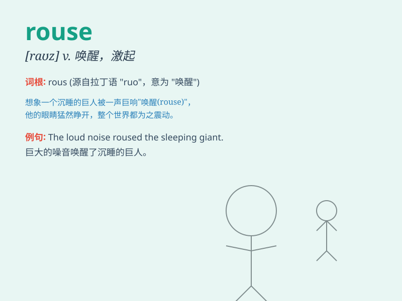

## rouse

**英音:** _[raʊz]_ **美音:** _[raʊz]_

**译义:** *v.唤醒,激起,使振奋,惊起n.觉醒,奋起*

### 短语

+ **rouse oneself:** _振作起来；起身_

+ **rouse from:** _从\...中醒来；从\...中唤起_

+ **rouse up:** _激起；唤起；使活跃_

+ **rouse sb\'s anger:** _激起某人的愤怒_

+ **rouse suspicion:** _引起怀疑_

### 例句

#### 例句1

> **The noise roused me from a deep sleep.**

**中文翻译:** 噪音把我从沉睡中吵醒。

**单词释义:** 唤醒；激起

#### 例句2

> **His speech roused the crowd to action.**

**中文翻译:** 他的演讲激起了群众采取行动。

**单词释义:** 激起；唤起

#### 例句3

> **She managed to rouse the children\'s interest in science.**

**中文翻译:** 她设法唤起孩子们对科学的兴趣。

**单词释义:** 唤起；激起

### 背诵小故事

> One day, a sleeping lion was roused by the loud noise of hunters. It
woke up angrily and showed its power. The hunters ran away in fear.
Remember, \'rouse\' means to wake up or stir up.

**一天，一只沉睡的狮子被猎人的巨大声响惊醒。它愤怒地醒来并展现出它的力量。猎人们惊恐地跑开了。记住，'rouse'意思是唤醒或激起。**

### 图义

