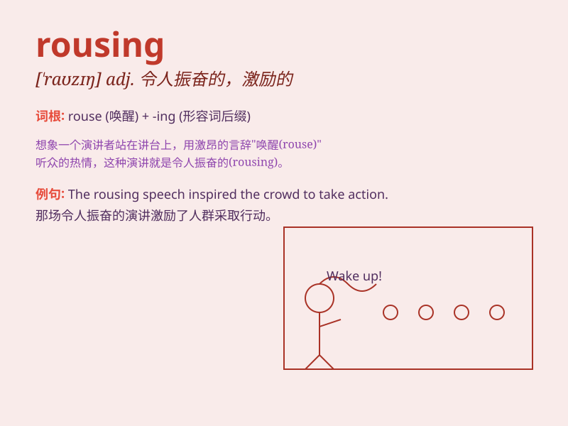

## rousing

**英音:** _[\'raʊzɪŋ]_ **美音:** _[\'raʊzɪŋ]_

**译义:** *adj.鼓舞人的,活跃的,非凡的*

### 短语

+ **rousing speech:** _振奋人心的演讲_

+ **rousing welcome:** _热烈的欢迎_

+ **rousing anthem:** _激昂的颂歌_

+ **rousing battle cry:** _鼓舞人心的战斗口号_

+ **rousing adventure:** _令人兴奋的冒险_

### 例句

#### 例句1

> **The speech was a rousing call to action.**

**中文翻译:** 这篇演讲是一个激动人心的行动呼吁。

**单词释义:** 令人振奋的

#### 例句2

> **The team gave a rousing performance and won the championship.**

**中文翻译:** 这个团队表现出色，令人振奋，并赢得了冠军。

**单词释义:** 鼓舞人心的

#### 例句3

> **The rousing music filled the stadium and lifted the spirits of
the crowd.**

**中文翻译:** 激昂的音乐充满了体育场，振奋了观众的精神。

**单词释义:** 充满活力的

### 背诵小故事

> In a sleepy town, a marching band started playing a rousing melody.
Everyone woke up, filled with energy and excitement. The music was so
powerful that it made the whole town come alive. Now you know,
\'rousing\' means exciting and energetic.

**在一个昏昏欲睡的小镇上，一支游行乐队开始演奏激昂的旋律。每个人都醒了过来，充满了活力和兴奋。这音乐如此有力，让整个小镇都活跃起来。现在你知道，'rousing'意味着令人兴奋和充满活力的。**

### 图义

