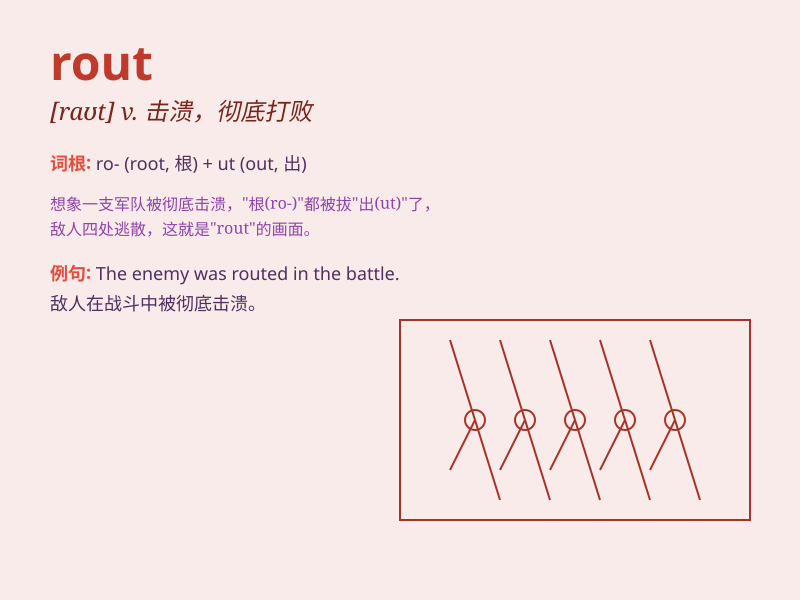

## rout

**英音:** _[raʊt]_ **美音:** _[raʊt]_

**译义:** *n.溃退v.击溃*

### 短语

+ **put to rout:** _击溃；打垮_

+ **rout out:** _搜寻出；驱逐_

+ **rout about:** _到处乱闯_

+ **rout through:** _贯穿；通过_

+ **in rout:** _在溃败中_

### 例句

#### 例句1

> **The army suffered a crushing rout in the battle.**

**中文翻译:** 这支军队在战斗中遭遇了惨败。

**单词释义:** 溃败；彻底失败

#### 例句2

> **The burglars were given a rout by the police.**

**中文翻译:** 窃贼们被警察彻底击溃了。

**单词释义:** 击溃；打败

#### 例句3

> **The team was in disarray after the rout.**

**中文翻译:** 在那次溃败之后，这个团队陷入了混乱。

**单词释义:** 大败；溃败

### 背诵小故事

>
在古代的战场上，敌军来袭，我方士兵陷入混乱。最终被打得大败，这是一场彻底的rout（溃败）。大家丢盔弃甲，四处逃窜。

**在古代战场，敌军让我方遭遇彻底的溃败，士兵丢盔弃甲逃窜。**

### 图义

