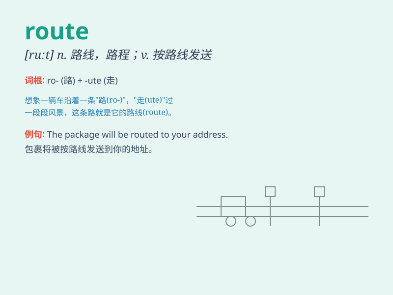

## route

**英音:** _[ruːt]_ **美音:** _[ruːt]_

**译义:** *n.路线,路程,通道v.发送*

### 短语

+ **delivery route:** _送货路线_

+ **travel route:** _旅行路线_

+ **bus route:** _公交路线_

+ **escape route:** _逃生路线_

+ **trade route:** _贸易路线_

### 例句

#### 例句1

> **The delivery man followed the usual route to reach the
customer\'s house.**

**中文翻译:** 送货员沿着通常的路线到达客户的家。

**单词释义:** 路线；路程

#### 例句2

> **They are planning a new route for the hiking trip.**

**中文翻译:** 他们正在为徒步旅行规划一条新路线。

**单词释义:** 路线；路径

#### 例句3

> **The bus route has changed due to road construction.**

**中文翻译:** 由于道路施工，公交车路线改变了。

**单词释义:** （公共汽车和列车等的）常规路线

### 背诵小故事

> One day, a traveler got lost. But he found a map marked with
different routes. He chose the right route and finally reached his
destination happily. Route means a way or path to go somewhere.

**有一天，一位旅行者迷路了。但他找到了一张标有不同路线的地图。他选择了正确的路线，最终愉快地到达了目的地。Route
意思是去某地的路或路径。**

### 图义

