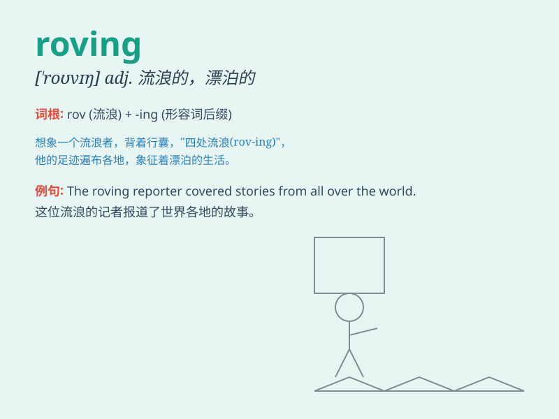

## roving

**英音:** _[\'rəʊvɪŋ]_ **美音:** _[\'rovɪŋ]_

**译义:** *n.粗纱*

### 短语

+ **roving eye:** _不专一的目光；色迷迷的目光_

+ **roving commission:** _巡回任务；流动使命_

+ **roving reporter:** _流动记者；巡回记者_

+ **roving bandit:** _流窜强盗；流动劫匪_

+ **roving gang:** _流窜团伙；流动帮派_

### 例句

#### 例句1

> **He spent his youth as a roving adventurer.**

**中文翻译:** 他年轻时是个四处闯荡的冒险家。

**单词释义:** 流动的；漂泊的

#### 例句2

> **The roving reporter covered many stories.**

**中文翻译:** 这位流动记者报道了很多新闻。

**单词释义:** 流动的；巡回的

#### 例句3

> **She has a roving eye and is always looking for new
opportunities.**

**中文翻译:** 她目光游移，总是在寻找新机会。

**单词释义:** 不固定的；徘徊的

### 背诵小故事

> A young artist was always on the roving, carrying his paints and
brushes. He went from town to town, seeking inspiration. His roving life
was full of adventures and surprises, which made his artworks unique.

**一位年轻的艺术家总是在流浪，带着他的颜料和画笔。他从一个城镇走到另一个城镇，寻求灵感。他的流浪生活充满了冒险和惊喜，这使他的作品独具特色。**

### 图义

