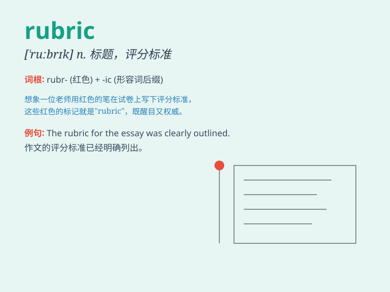

## rubric

**英音:** _[\'ruːbrɪk]_ **美音:** _[\'rubrɪk]_

**译义:** *n.[印]红字,红色印刷,题目*

### 短语

+ **grading rubric:** _评分标准_

+ **design rubric:** _设计准则_

+ **assessment rubric:** _评估准则_

+ **writing rubric:** _写作规范_

+ **evaluation rubric:** _评价标准_

### 例句

#### 例句1

> **The rubric for the essay competition was clearly defined.**

**中文翻译:** 这次作文比赛的规则被清晰地界定了。

**单词释义:** 规则；标准

#### 例句2

> **The teacher provided a rubric to grade the students\'
projects.**

**中文翻译:** 老师提供了一个给学生项目打分的标准。

**单词释义:** 评分标准

#### 例句3

> **The rubric of the exam stated that no calculators were
allowed.**

**中文翻译:** 考试的规则表明不允许使用计算器。

**单词释义:** 规则；规定

### 背诵小故事

> A student was confused about the rubric for an art project. The
teacher explained that the rubric was like a map guiding what was needed
for a top score. With this, the student understood and followed the
rules to succeed.

**一名学生对一个艺术项目的评分标准感到困惑。老师解释说，评分标准就像一张地图，指引着获得高分所需的条件。有了这个解释，学生明白了并遵循规则取得了成功。**

### 图义

