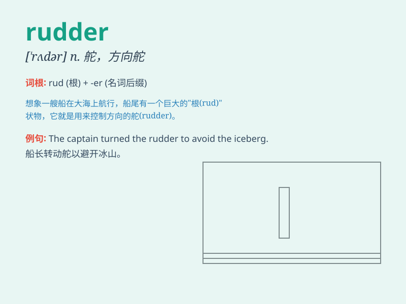

## rudder

**英音:** _[\'rʌdə]_ **美音:** _[\'rʌdɚ]_

**译义:** *n.舵,方向舵*

### 短语

+ **steer the rudder:** _操纵舵_

+ **rudder control:** _舵控制_

+ **adjust the rudder:** _调整舵_

+ **ship\'s rudder:** _船的舵_

+ **rudder angle:** _舵角_

### 例句

#### 例句1

> **The rudder helps the ship change direction.**

**中文翻译:** 船舵帮助船只改变方向。

**单词释义:** 船舵

#### 例句2

> **The pilot controlled the plane by manipulating the rudder.**

**中文翻译:** 飞行员通过操纵方向舵来控制飞机。

**单词释义:** 方向舵

#### 例句3

> **The rudder of the kayak was damaged during the adventure.**

**中文翻译:** 皮艇的舵在冒险过程中损坏了。

**单词释义:** 舵

### 背诵小故事

> A brave sailor was lost at sea. Just when he felt hopeless, he saw a
rudder floating nearby. Grabbing it, he steered the boat safely home.
The rudder became his savior.

**一位勇敢的水手在海上迷失了方向。就在他感到绝望时，他看到附近漂浮着一个舵。抓住它，他驾驶着船安全回家。这个舵成了他的救星。**

### 图义

