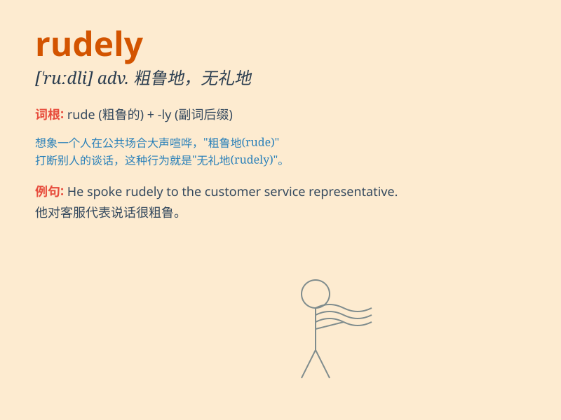

## rudely

**英音:** _[ˈruːdli]_ **美音:** _[ˈruːdli]_

**译义:** *adv.粗暴地,无礼地*

### 短语

+ **speak rudely:** _说话粗鲁_

+ **act rudely:** _行为粗鲁_

+ **treat rudely:** _粗暴对待_

+ **respond rudely:** _回应粗鲁_

+ **interrupt rudely:** _粗鲁地打断_

### 例句

#### 例句1

> **He spoke rudely to the waitress.**

**中文翻译:** 他对女服务员说话很粗鲁。

**单词释义:** 粗鲁地；无礼地

#### 例句2

> **The customer treated the clerk rudely.**

**中文翻译:** 这位顾客对待店员很无礼。

**单词释义:** 粗暴地；不客气地

#### 例句3

> **She was rudely interrupted while giving her speech.**

**中文翻译:** 她在演讲时被粗鲁地打断了。

**单词释义:** 粗鲁地；突然地

### 背诵小故事

> One day, Tom was asking for directions. But the person responded
rudely, saying \'I don\'t have time for you!\' This made Tom very
unhappy. Remember, rudely means being impolite and having bad manners.

**一天，汤姆在问路。但那个人很粗鲁地回答说：'我没时间理你！'这让汤姆非常不高兴。记住，rudely
意思是不礼貌，态度恶劣。**

### 图义

