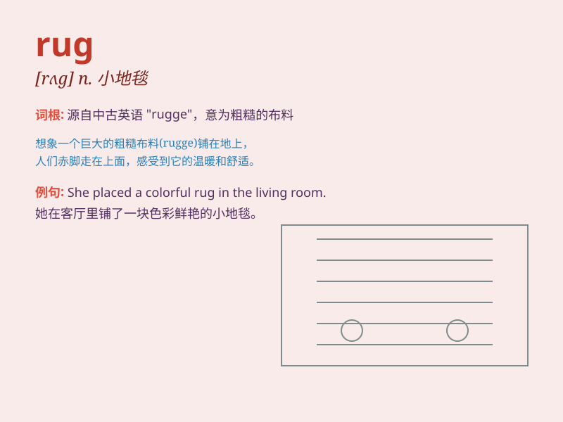

## rug

**英音:** _[rʌg]_ **美音:** _[rʌɡ]_

**译义:** *n.(小)地毯,垫子*

### 短语

+ **oriental rug:** _东方地毯_

+ **floor rug:** _地毯；地垫_

+ **bathroom rug:** _浴室地毯_

+ **wool rug:** _羊毛地毯_

+ **decorative rug:** _装饰地毯_

### 例句

#### 例句1

> **The rug in the living room adds warmth to the space.**

**中文翻译:** 客厅里的地毯给这个空间增添了温暖。

**单词释义:** 地毯

#### 例句2

> **She tripped over the edge of the rug.**

**中文翻译:** 她被地毯的边绊倒了。

**单词释义:** 地毯

#### 例句3

> **The cat is sleeping on the rug.**

**中文翻译:** 猫正在地毯上睡觉。

**单词释义:** 地毯

### 背诵小故事

> One day, I walked into a room and saw a colorful rug on the floor. It
was so soft that when I stepped on it, it felt like walking on a cloud.
The rug had beautiful patterns and made the room look warm and cozy.

**有一天，我走进一个房间，看到地板上有一块色彩斑斓的小地毯。它非常柔软，当我踩上去时，感觉就像走在云朵上。这块地毯有着美丽的图案，让房间看起来温馨又舒适。**

### 图义

