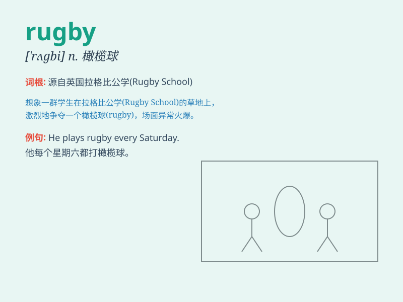

## rugby

**英音:** _[ˈrʌɡbi]_ **美音:** _[ˈrʌɡbi]_

**译义:** *n.橄榄球*

### 短语

+ **rugby union:** _橄榄球联合会_

+ **rugby player:** _橄榄球运动员_

+ **rugby field:** _橄榄球场_

+ **rugby match:** _橄榄球比赛_

+ **rugby club:** _橄榄球俱乐部_

### 例句

#### 例句1

> **He is passionate about rugby and plays it every weekend.**

**中文翻译:** 他热衷于橄榄球，每个周末都打。

**单词释义:** 橄榄球

#### 例句2

> **The rugby match attracted a large crowd of spectators.**

**中文翻译:** 这场橄榄球比赛吸引了大批观众。

**单词释义:** 橄榄球

#### 例句3

> **She learned the rules of rugby quickly.**

**中文翻译:** 她很快学会了橄榄球的规则。

**单词释义:** 橄榄球

### 背诵小故事

> One day, Tom went to watch a sports game. He saw two teams fiercely
competing on the field. The players were running, passing, and
tacklinging. He asked what it was and was told it was rugby. From then
on, he remembered this exciting sport.

**一天，汤姆去看体育比赛。他看到两队在场上激烈角逐。球员们奔跑、传球和阻截。他问这是什么，被告知这是橄榄球。从那以后，他记住了这项激动人心的运动。**

### 图义

