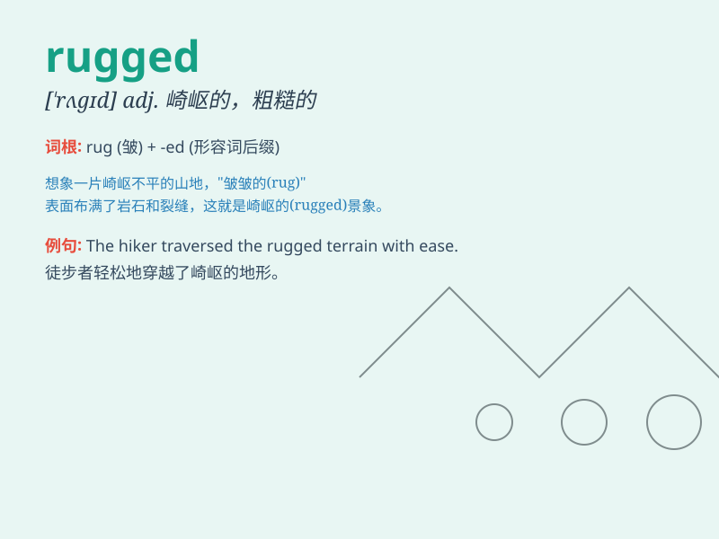

## rugged

**英音:** _[\'rʌgɪd]_ **美音:** _[\'rʌɡɪd]_

**译义:** *adj.高低不平的,崎岖的,粗糙的,有皱纹的*

### 短语

+ **rugged terrain:** _崎岖的地形_

+ **rugged individualism:** _顽强的个人主义_

+ **rugged coastline:** _崎岖的海岸线_

+ **rugged outdoors:** _艰苦的户外环境_

+ **rugged appearance:** _粗犷的外表_

### 例句

#### 例句1

> **The mountain road was rugged and difficult to drive on.**

**中文翻译:** 这条山路崎岖不平，很难开车行驶。

**单词释义:** 崎岖不平的

#### 例句2

> **He has a rugged face with a strong jawline.**

**中文翻译:** 他有一张轮廓粗犷、下巴坚毅的脸。

**单词释义:** 粗犷的；坚毅的

#### 例句3

> **The rugby player had a rugged build, making him tough to
tackle.**

**中文翻译:** 这位橄榄球运动员体格健壮，很难被抱住拦截。

**单词释义:** 健壮的

### 背诵小故事

> A brave hiker was climbing a mountain. The path was rugged, full of
rocks and uneven terrain. But he didn\'t give up and finally reached the
top. Remember, \'rugged\' means rough and uneven.

**一位勇敢的徒步旅行者正在爬山。这条路崎岖不平，布满了岩石和高低不平的地形。但他没有放弃，最终到达了山顶。记住，'rugged'意思是粗糙不平的。**

### 图义

