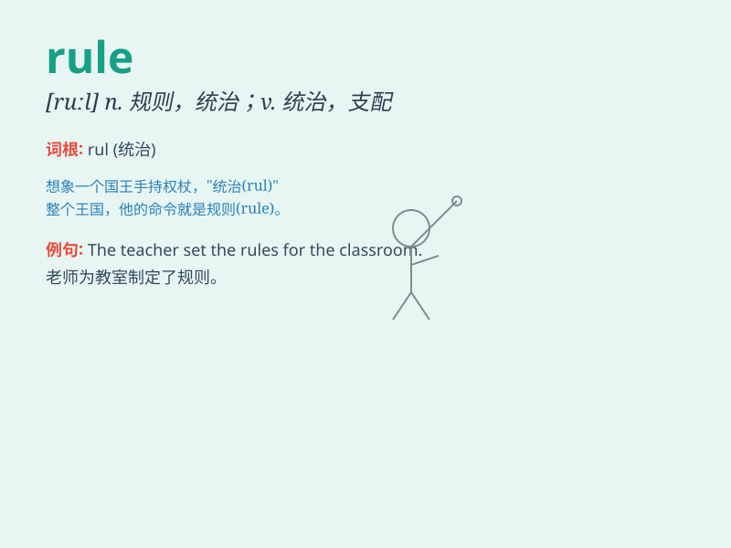

## rule

**英音:** _[ruːl]_ **美音:** _[rul]_

**译义:**
*n.规则,惯例,统治,章程,破折号,准则,标准,控制vt.规定,统治,支配,裁决vi.统治,管辖,裁定n.规则,水线*

### 短语

+ **break the rule:** _违反规则_

+ **follow the rule:** _遵循规则_

+ **set a rule:** _制定规则_

+ **as a rule:** _通常；一般说来_

+ **rule out:** _排除；不予考虑_

### 例句

#### 例句1

> **The school has strict rules about uniform.**

**中文翻译:** 这所学校对校服有严格的规定。

**单词释义:** 规定；规则

#### 例句2

> **He always follows the rule of never eating after 8 p.m.**

**中文翻译:** 他总是遵循晚上 8 点以后不吃东西的规则。

**单词释义:** 规则；准则

#### 例句3

> **It\'s a rule that you must be quiet in the library.**

**中文翻译:** 在图书馆里必须保持安静，这是一条规定。

**单词释义:** 规定；法则

### 背诵小故事

> The king had many rules. One rule was that everyone must bow before
him. But a brave girl questioned this rule and made the king think. In
the end, some unfair rules were changed.

**国王有很多规则。其中一条规则是每个人都必须在他面前鞠躬。但一个勇敢的女孩质疑了这条规则，让国王思考。最后，一些不公平的规则被改变了。**

### 图义

