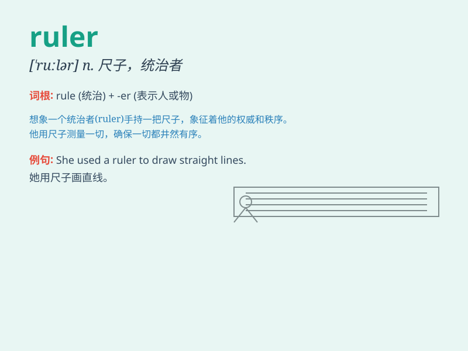

## ruler

**英音:** _[\'ruːlə]_ **美音:** _[\'rulɚ]_

**译义:** *n.统治者,管理者,尺,直尺n.标尺,划线板,划线的人*

### 短语

+ **a straight ruler:** _一把直尺_

+ **folding ruler:** _折尺_

+ **ruler and compass construction:** _尺规作图_

+ **steel ruler:** _钢尺_

+ **tape ruler:** _卷尺_

### 例句

#### 例句1

> **The ruler is made of plastic.**

**中文翻译:** 这把尺子是塑料制成的。

**单词释义:** 尺子

#### 例句2

> **He is a powerful ruler of the kingdom.**

**中文翻译:** 他是这个王国的强大统治者。

**单词释义:** 统治者

#### 例句3

> **Use a ruler to draw a straight line.**

**中文翻译:** 用尺子画一条直线。

**单词释义:** 尺子

### 背诵小故事

> The king held a shiny ruler in his hand. With it, he measured the
land and marked the boundaries. The ruler was not just a tool but a
symbol of his power and authority.

**国王手中握着一把闪亮的尺子。用它来测量土地并标记边界。这把尺子不仅是一个工具，更是他权力和权威的象征。**

### 图义

