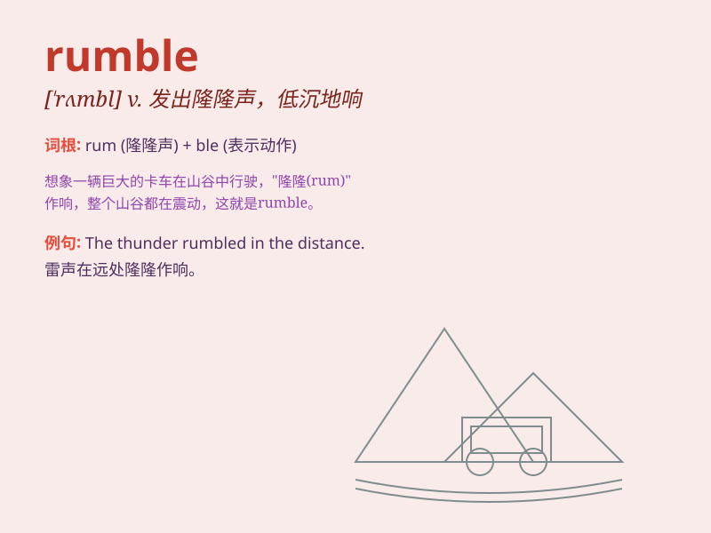

## rumble

**英音:** _[\'rʌmb(ə)l]_ **美音:** _[\'rʌmbl]_

**译义:** *v.隆隆声,辘辘行驶,低沉地说n.隆隆声,辘辘声,吵嚷声*

### 短语

+ **rumble on:** _持续低沉地响；继续下去_

+ **rumble out:** _低沉地说出_

+ **rumble through:** _隆隆地穿过_

+ **rumble sth. off:** _很快地说出某事_

+ **rumble around:** _到处发出低沉的声音_

### 例句

#### 例句1

> **The thunder rumbled in the distance.**

**中文翻译:** 雷声在远处隆隆作响。

**单词释义:** 发出隆隆声；轰鸣

#### 例句2

> **The truck rumbled along the rough road.**

**中文翻译:** 卡车在崎岖的道路上隆隆行驶。

**单词释义:** （车辆）辘辘行驶

#### 例句3

> **I could hear the rumble of the approaching train.**

**中文翻译:** 我能听到即将到来的火车的隆隆声。

**单词释义:** 发出持续而低沉的声音

### 背诵小故事

> A big bear was rumbling in the forest. Its heavy steps and low growls
made a rumble that scared all the little animals. They knew it was a
sign of the bear\'s power and presence.

**一只大熊在森林里轰隆作响。它沉重的脚步和低沉的吼声发出轰隆声，把所有小动物都吓到了。他们知道这是熊力量和存在的标志。**

### 图义

