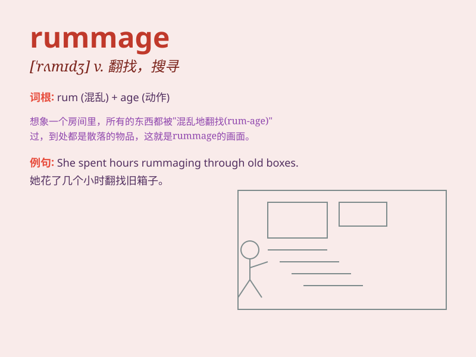

## rummage

**英音:** _[\'rʌmɪdʒ]_ **美音:** _[\'rʌmɪdʒ]_

**译义:** *v.到处翻寻,搜出,检查n.翻箱倒柜的寻找,检查,零星杂物*

### 短语

+ **rummage sale:** _清仓大甩卖；杂物拍卖_

+ **rummage through:** _翻找；仔细搜查_

+ **rummage around:** _到处翻寻；四处搜寻_

+ **rummage in:** _在\...\...里翻找_

+ **have a rummage:** _进行一番翻找_

### 例句

#### 例句1

> **I rummaged through the drawer looking for my keys.**

**中文翻译:** 我在抽屉里翻找我的钥匙。

**单词释义:** 翻找；搜寻

#### 例句2

> **She rummaged in her bag for a pen.**

**中文翻译:** 她在包里乱翻找一支笔。

**单词释义:** 翻寻；乱翻

#### 例句3

> **He spent the morning rummaging in the attic.**

**中文翻译:** 他花了一上午在阁楼里翻找东西。

**单词释义:** 仔细搜查；翻查

### 背诵小故事

> A thief rummaged through the room, looking for valuable things. He
was in a hurry and made a mess. Finally, he was caught by the police.

**一个小偷在房间里翻找，寻找值钱的东西。他很匆忙，把房间弄得一团糟。最后，他被警察抓住了。**

### 图义

