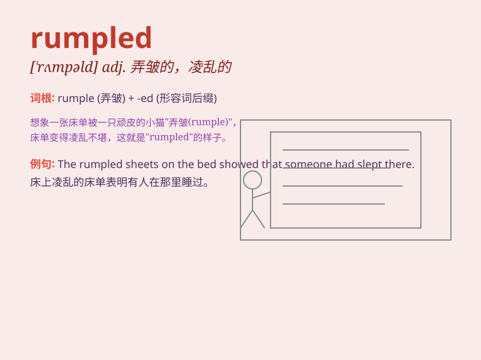

## rumpled

**英音:** _[ˈrʌmpəld]_ **美音:** _[ˈrʌmpəld]_

**译义:** *adj. 弄皱的；凌乱的 v. 弄皱；变皱（rumple
的过去式和过去分词）*

### 短语

+ **rumpled hair:** _凌乱的头发_

+ **rumpled shirt:** _皱巴巴的衬衫_

+ **rumpled bed:** _凌乱的床_

+ **rumpled appearance:** _邋遢的外表_

+ **rumpled clothes:** _皱巴巴的衣服_

### 例句

#### 例句1

> **Her dress was rumpled after the long journey.**

**中文翻译:** 经过长途旅行，她的裙子变得皱巴巴的。

**单词释义:** 皱巴巴的

#### 例句2

> **He rumpled his hair in frustration.**

**中文翻译:** 他沮丧地弄乱了自己的头发。

**单词释义:** 弄乱；使起皱

#### 例句3

> **The bedsheets were rumpled when she woke up.**

**中文翻译:** 她醒来时床单皱皱的。

**单词释义:** 皱的；凌乱的

### 背诵小故事

> One day, Tom was in a hurry and didn\'t make his bed. The sheets were
rumpled. His mom came in and said, \'Look at these rumpled sheets! You
should keep your bed tidy.\'

**一天，汤姆很匆忙，没有整理床铺。床单变得皱巴巴的。他妈妈走进来说：'看看这些皱巴巴的床单！你应该保持床铺整洁。'**

### 图义

