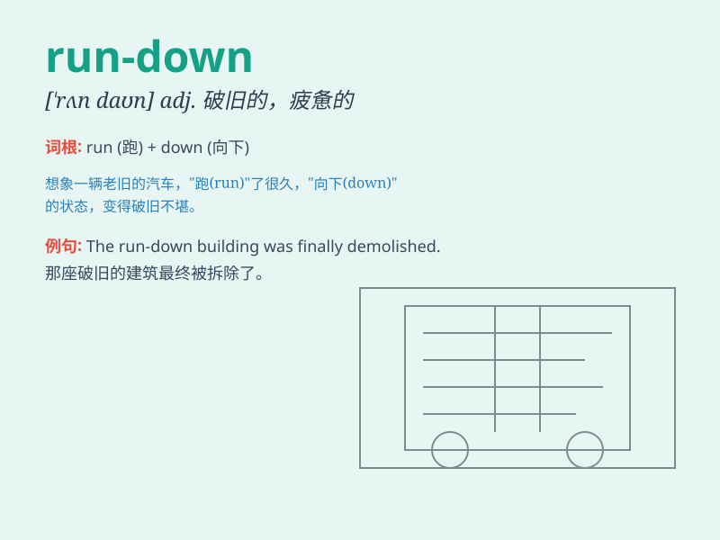

## run-down

**英音:** _[rʌnˈdaʊn]_ **美音:** _[rʌnˈdaʊn]_

**译义:**
*n.详细情况，彻底检查；adj.详尽的，破旧的；v.详细说明，使彻底检查*

### 短语

+ **run-down area:** _破旧地区；衰败地区_

+ **run-down building:** _破旧的建筑物_

+ **run-down condition:** _破旧的状况；衰败的状态_

+ **feel run-down:** _感到疲惫不堪；身体虚弱_

+ **a run-down car:** _一辆破旧的汽车_

### 例句

#### 例句1

> **The old factory is in a run-down condition.**

**中文翻译:** 这座旧工厂处于破败的状态。

**单词释义:** 破败的；失修的

#### 例句2

> **He gave me a run-down of the meeting.**

**中文翻译:** 他给我简要介绍了会议的情况。

**单词释义:** 概要；简述

#### 例句3

> **I feel really run-down after a week of hard work.**

**中文翻译:** 经过一周的辛苦工作，我感觉筋疲力尽。

**单词释义:** 精疲力竭的；衰弱的

### 背诵小故事

>
想象一个跑步比赛，选手们一开始跑得很快，但到最后都精疲力竭，速度越来越慢。这个场景就像一个
run-down 的状态，破败、衰弱。比如老旧的房子就处于 run-down 的状态。

**想象跑步比赛中选手的状态来理解破败、衰弱的'run-down'，如老旧房子的状况**

### 图义

