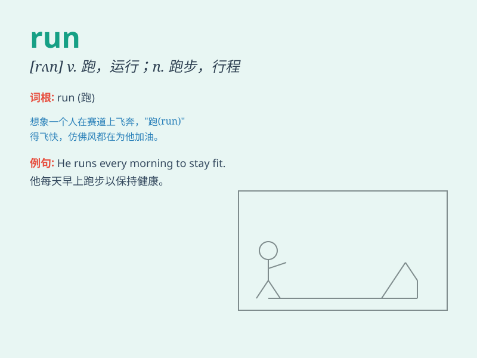

## run

**英音:** _[rʌn]_ **美音:** _[rʌn]_

**译义:**
*n.跑,赛跑,奔跑,运转,趋向vi.跑,奔,逃跑,竞选,跑步,蔓延,进行,行驶vt.使跑,参赛,追究,使流,管理,运行,开动adj.熔化的,融化的,浇铸的
vbl.run的过去式和过去分词*

### 短语

+ **run away:** _逃跑；逃走_

+ **run into:** _撞上；偶然遇见_

+ **run out:** _用完；耗尽_

+ **run after:** _追赶；追求_

+ **run through:** _贯穿；匆匆浏览_

### 例句

#### 例句1

> **I run every morning to keep fit.**

**中文翻译:** 我每天早上跑步来保持健康。

**单词释义:** 跑步；奔跑

#### 例句2

> **The river runs through the forest.**

**中文翻译:** 这条河穿过森林。

**单词释义:** 流淌；流动

#### 例句3

> **The machine is running smoothly.**

**中文翻译:** 这台机器运转平稳。

**单词释义:** 运转；运行

### 背诵小故事

> One day, Tom was late for school. So he had to run very fast. When he
finally reached the classroom, he was out of breath. \'Run\' means to
move quickly by using your legs.

**一天，汤姆上学迟到了。所以他不得不跑得非常快。当他终于到达教室时，他气喘吁吁。\'run\'的意思是用腿快速移动。**

### 图义

