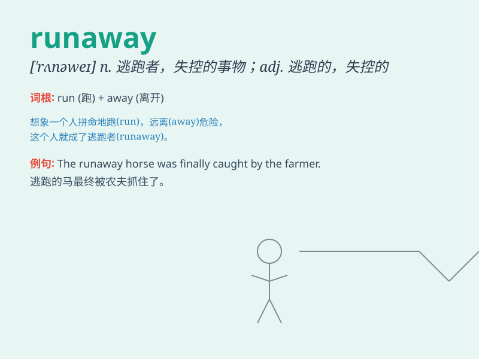

## runaway

**英音:** _[\'rʌnəweɪ]_ **美音:** _[\'rʌnəwe]_

**译义:**
*n.逃跑,逃跑者,巨大的胜利,失控的车(或核子反应堆系统)adj.逃亡的,逃走的*

### 短语

+ **runaway success:** _巨大的成功_

+ **runaway inflation:** _失控的通货膨胀_

+ **runaway growth:** _飞速增长_

+ **runaway horse:** _脱缰的马_

+ **runaway slave:** _逃跑的奴隶_

### 例句

#### 例句1

> **The runaway horse galloped down the street.**

**中文翻译:** 那匹脱缰的马沿着街道飞奔。

**单词释义:** 脱缰的；失控的

#### 例句2

> **She was a runaway teenager who left home to escape her
problems.**

**中文翻译:** 她是个离家出走的青少年，为逃避问题而离开家。

**单词释义:** 离家出走的

#### 例句3

> **The runaway success of the new product exceeded our
expectations.**

**中文翻译:** 新产品获得的巨大成功超出了我们的预期。

**单词释义:** 迅猛发展的；一举成功的

### 背诵小故事

> Once upon a time, there was a horse. It always ran away from its
stable. People called it a runaway horse. It was hard to catch. But
finally, with patience, they did. Runaway means to escape or flee.

**从前，有一匹马。它总是从马厩跑走。人们称它为逃跑的马。很难抓住它。但最终，凭借耐心，人们做到了。runaway
意思是逃跑、逃走。**

### 图义

