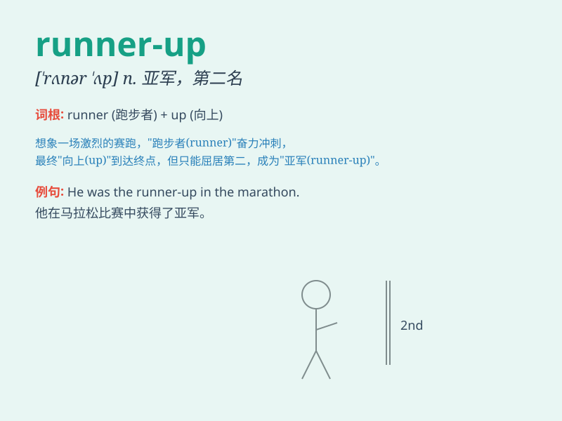

## runner-up

**英音:** _[ˈrʌnə(r) ʌp]_ **美音:** _[ˈrʌnər ʌp]_

**译义:** *n.亚军；第二名*

### 短语

+ **be the runner-up:** _成为亚军_

+ **the runner-up in the competition:** _比赛中的亚军_

+ **award the runner-up:** _授予亚军_

+ **runner-up position:** _亚军位置_

+ **the runner-up prize:** _亚军奖品_

### 例句

#### 例句1

> **She was the runner-up in the singing competition.**

**中文翻译:** 她是歌唱比赛的亚军。

**单词释义:** 亚军；第二名

#### 例句2

> **The runner-up received a consolation prize.**

**中文翻译:** 亚军获得了一份安慰奖。

**单词释义:** 亚军；第二名

#### 例句3

> **He was disappointed to be only the runner-up in the race.**

**中文翻译:** 他在比赛中只获得亚军，感到很失望。

**单词释义:** 亚军；第二名

### 背诵小故事

>
想象一场激烈的跑步比赛，小明拼尽全力冲刺，最终获得了第二名。大家都称呼他为
runner-up。这就像在众多选手中，虽然不是冠军，但也是非常出色的亚军。

**想象一场跑步比赛中小明获得亚军的情景来辅助记忆 runner-up
这个表示亚军、第二名的单词**

### 图义

