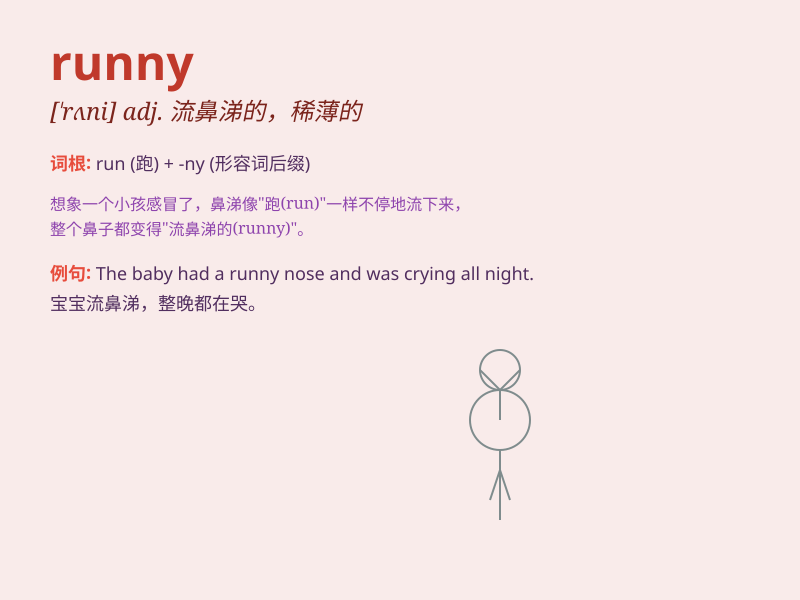

## runny

**英音:** _[\'rʌnɪ]_ **美音:** _[\'rʌni]_

**译义:** *adj.松软的,水分过多的,流鼻水的,易流动的*

### 短语

+ **runny nose:** _流鼻涕_

+ **runny eyes:** _流眼泪_

+ **runny cheese:** _软质奶酪_

+ **runny ink:** _洇墨_

+ **runny makeup:** _花掉的妆容_

### 例句

#### 例句1

> **The cheese has a runny consistency.**

**中文翻译:** 这种奶酪质地很稀。

**单词释义:** 稀的；水分过多的

#### 例句2

> **I have a runny nose today.**

**中文翻译:** 我今天流鼻涕。

**单词释义:** 流鼻涕的

#### 例句3

> **The runny ink made the writing illegible.**

**中文翻译:** 墨水太稀，写的字都看不清了。

**单词释义:** 稀薄的；流质的

### 背诵小故事

> One day, I was making an omelette. But the eggs I cracked were runny
and kept flowing everywhere. It was a messy situation! I had to clean up
quickly.

**有一天，我正在做煎蛋卷。但我敲开的鸡蛋是稀的，不停地到处流。真是一团糟！我不得不赶紧清理。**

### 图义

