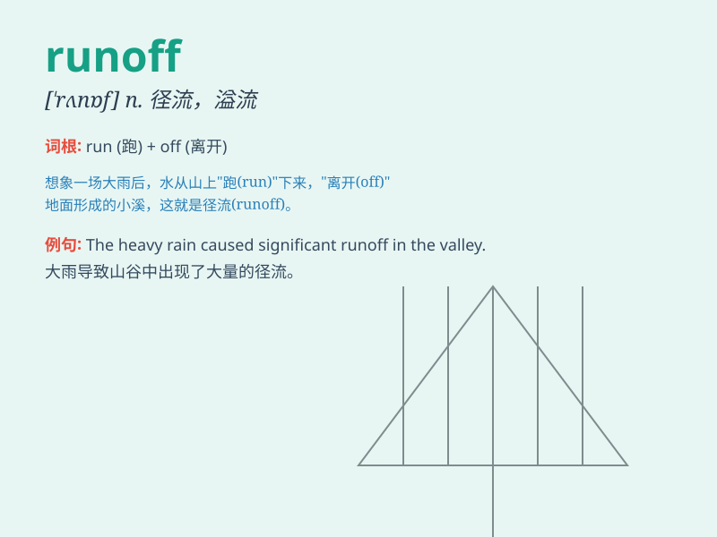

## runoff

**英音:** _[\'rʌnɒf]_ **美音:** _[\'rʌnɔf]_

**译义:** *n.流走之物,决赛,决定性竞选*

### 短语

+ **runoff election:** _决胜选举；第二轮选举_

+ **surface runoff:** _地表径流；地面迳流_

+ **runoff water:** _径流水；流失的水_

+ **rainfall runoff:** _降雨径流_

+ **runoff channel:** _径流通道；排水渠道_

### 例句

#### 例句1

> **The runoff from the heavy rain caused flooding in the
streets.**

**中文翻译:** 暴雨的径流导致街道洪水泛滥。

**单词释义:** （雨水、污水等的）径流

#### 例句2

> **The runoff election will be held next week.**

**中文翻译:** 决胜选举将于下周举行。

**单词释义:** （竞选的）决胜投票

#### 例句3

> **The factory\'s runoff has polluted the nearby river.**

**中文翻译:** 这家工厂的废水污染了附近的河流。

**单词释义:** （工厂排出的）废水

### 背诵小故事

> A heavy rain caused a huge runoff. The water rushed down the
mountain, carrying away small stones and branches. It was like a wild
race. Finally, the runoff reached the river and joined the flow.

**一场大雨导致了大量的径流。水从山上冲下来，带走了小石块和树枝。这就像一场疯狂的赛跑。最后，径流到达了河流并汇入其中。**

### 图义

