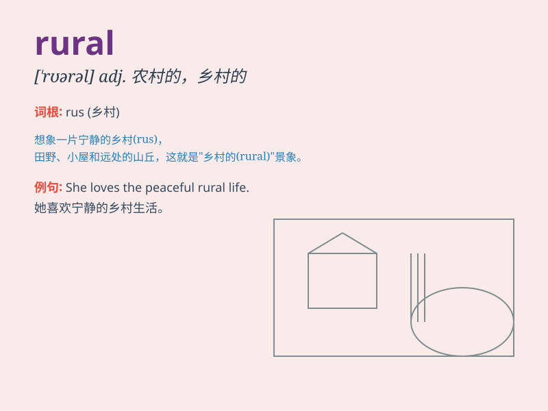

## rural

**英音:** _[\'rʊər(ə)l]_ **美音:** _[\'rʊrəl]_

**译义:** *adj.乡下的,田园的,乡村风味的,生活在农村的*

### 短语

+ **rural area:** _农村地区_

+ **rural life:** _乡村生活_

+ **rural development:** _农村发展_

+ **rural population:** _农村人口_

+ **rural scenery:** _乡村景色_

### 例句

#### 例句1

> **The rural area is very peaceful and quiet.**

**中文翻译:** 农村地区非常宁静祥和。

**单词释义:** 农村的；乡村的

#### 例句2

> **She prefers the rural life to the urban one.**

**中文翻译:** 她喜欢乡村生活胜过城市生活。

**单词释义:** 乡村的；田园的

#### 例句3

> **Rural development is a key issue for the government.**

**中文翻译:** 农村发展是政府的一个关键问题。

**单词释义:** 农村的；乡下的

### 背诵小故事

> A boy named Tom lived in a rural area. He enjoyed the fresh air, vast
fields, and peaceful life. Every day, he could see cows and sheep. Rural
life made him happy and carefree.

**一个叫汤姆的男孩住在农村地区。他享受着新鲜的空气、广阔的田野和平静的生活。每天，他都能看到牛羊。农村生活让他快乐又无忧无虑。**

### 图义

