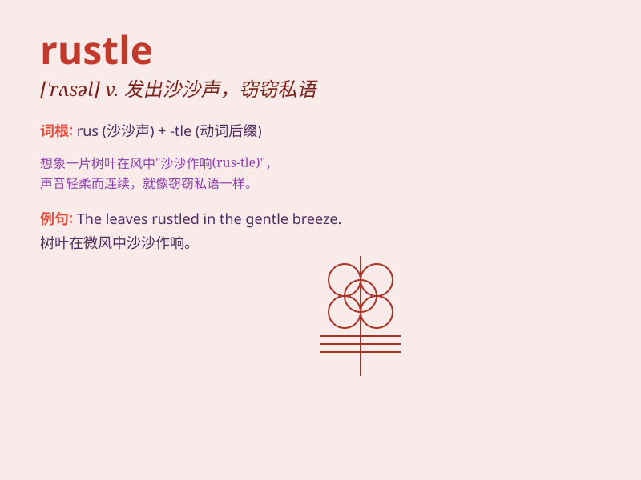

## rustle

**英音:** _[\'rʌs(ə)l]_ **美音:** _[\'rʌsl]_

**译义:**
*n.沙沙声,飒飒声vi.发出沙沙声,奋力工作,急速移动vt.使沙沙响*

### 短语

+ **rustle up:** _匆匆准备（食物等）_

+ **rustle through:** _快速翻阅；匆匆做完_

+ **the rustle of leaves:** _树叶的沙沙声_

+ **rustle sth. out:** _迅速拿出某物_

+ **rustle in the bushes:** _在灌木丛中发出沙沙声_

### 例句

#### 例句1

> **The leaves rustled in the wind.**

**中文翻译:** 树叶在风中沙沙作响。

**单词释义:** 发出沙沙声

#### 例句2

> **She heard a rustle of papers in the next room.**

**中文翻译:** 她听到隔壁房间有纸张的沙沙声。

**单词释义:** 发出沙沙声；使发出沙沙声

#### 例句3

> **The rustle of her dress could be heard as she walked.**

**中文翻译:** 她走路时能听到她裙子的沙沙声。

**单词释义:** 沙沙作响

### 背诵小故事

> One night in the forest, I heard a rustle. I was scared. But when I
looked closely, it was just a little squirrel moving through the dry
leaves. The sound of the leaves rubbing together was the rustle I heard.

**一天晚上在森林里，我听到一阵沙沙声。我很害怕。但当我仔细看时，只是一只小松鼠在干树叶中穿梭。树叶相互摩擦发出的声音就是我听到的沙沙声。**

### 图义

