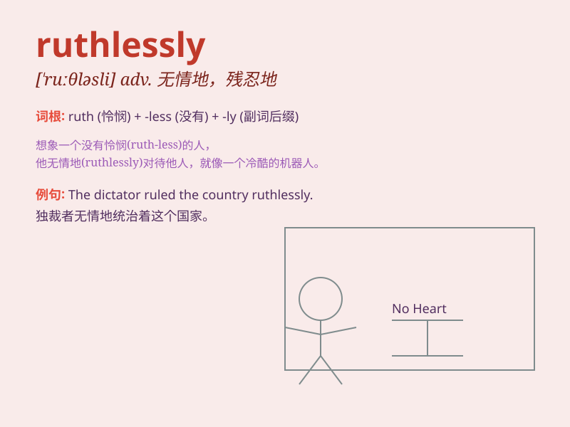

## ruthlessly

**英音:** _[\'ruːθləsli]_ **美音:** _[\'ruːθləsli]_

**译义:** *adv.冷酷地,残忍地*

### 短语

+ **ruthlessly cruel:** _极其残忍_

+ **ruthlessly efficient:** _极其高效_

+ **ruthlessly competitive:** _残酷竞争_

+ **ruthlessly exploit:** _无情地剥削_

+ **ruthlessly suppress:** _残酷镇压_

### 例句

#### 例句1

> **The company ruthlessly cut jobs to increase profits.**

**中文翻译:** 这家公司为了增加利润无情地裁员。

**单词释义:** 无情地

#### 例句2

> **He was ruthlessly criticized for his mistake.**

**中文翻译:** 他因为自己的错误受到了无情的批评。

**单词释义:** 无情地

#### 例句3

> **The dictator ruled the country ruthlessly.**

**中文翻译:** 这个独裁者无情地统治着这个国家。

**单词释义:** 无情地

### 背诵小故事

> A cruel king ruled the land ruthlessly. He showed no mercy to his
people, taking away their food and homes. But in the end, the people
rose up and overthrew him. Remember, \'ruthlessly\' means without mercy
or compassion.

**一个残暴的国王无情地统治着这片土地。他对他的人民毫无怜悯之心，夺走了他们的食物和家园。但最终，人民奋起反抗并推翻了他。记住，\'ruthlessly\'意思是无情地；残忍地；毫不留情地**

### 图义

